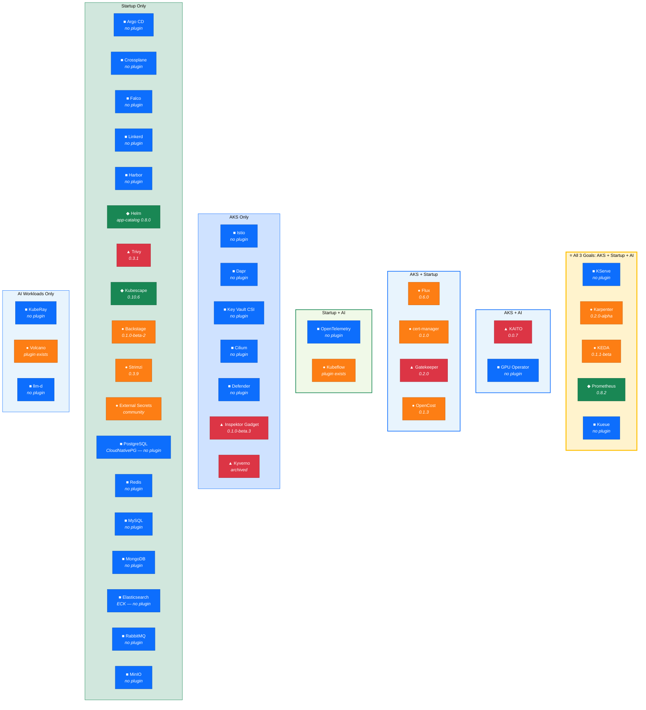
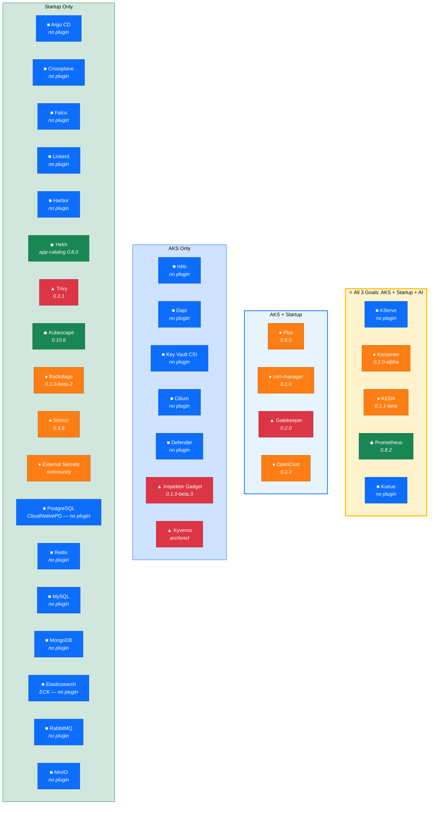
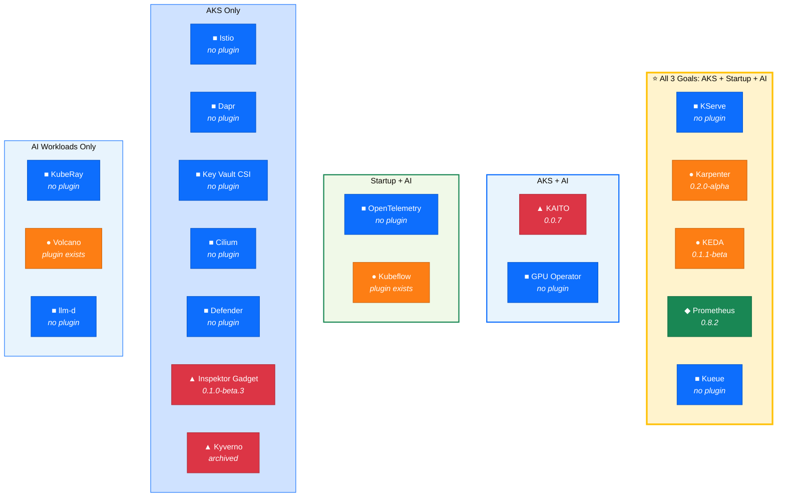

# AKS Features That Could Be Supported by Headlamp

This report lists Azure Kubernetes Service (AKS) features that Headlamp could support,
ranked by implementation difficulty. It also covers CNCF project extensions that AKS uses,
existing Headlamp plugins that already provide coverage, and what
[AKS desktop](https://github.com/Azure/aks-desktop) (built on Headlamp) has already
implemented.

## Sources Consulted

- [headlamp-k8s/plugins](https://github.com/headlamp-k8s/plugins/) — official Headlamp plugins
- [Artifact Hub — Headlamp plugins](https://artifacthub.io/packages/search?kind=21&sort=relevance) — plugin registry
- [Azure/aks-desktop](https://github.com/Azure/aks-desktop) — AKS desktop (built on Headlamp)
- [AKS integrations docs](https://learn.microsoft.com/en-us/azure/aks/integrations) — official AKS add-ons/extensions list
- [docs/platforms.md](../platforms.md) — Headlamp tested platforms and CNCF integrations

## Difficulty Scale

| Rating | Meaning |
|--------|---------|
| ✅ Done | Already covered by an existing official or community plugin, or by AKS desktop |
| 🟢 Easy | Can be done with existing plugin APIs or small frontend changes; mostly UI work using standard Kubernetes APIs |
| 🟡 Medium | Requires new frontend components, CRD-aware views, or moderate backend work |
| 🔴 Hard | Requires significant backend changes, new external API integrations, or Azure-specific API calls |

---

## Strategic Alternatives (5 engineers, 3 months + 2 FTE AKS desktop)

This section presents 6 strategic options for a team of 5 engineers over a 3-month project,
plus 2 full-time engineers dedicated to AKS desktop. Strategies A-C are general approaches;
**Strategy D targets the startup market**, **Strategy E targets the AKS ecosystem
specifically**, and **Strategy F targets AI/ML workloads**. Each includes an ordered list
of which plugins to develop or polish first.

The analysis uses the "diagnose → guiding policy → coherent action" structure from Richard
Rumelt's *Good Strategy/Bad Strategy* and identifies the **crux** — the single hardest
challenge whose resolution unlocks the rest.

### The Crux

**The plugin ecosystem is broad but shallow.** Headlamp has 20+ plugins covering AKS-relevant
features, but most are early-stage (v0.1.x), lack internationalization (only 2 of 12 official
plugins have full i18n), have no dedicated a11y test suites, and community plugins live outside
the official repo — making quality, maintenance, and discoverability inconsistent. The crux is
not "build more plugins" — it is **"make the existing plugins production-grade while filling
the 3-4 highest-impact gaps."**

### Strategy A: "Go Deep" — Polish Existing, Fill Critical Gaps

**Diagnosis:** The biggest immediate value is making what already exists reliable and
enterprise-ready. 15+ features are "covered" but most plugins are alpha/beta quality.

**Guiding policy:** Prioritize depth over breadth. Bring the 8-10 most important existing
plugins to v1.0 production quality before building new ones.

**Coherent actions (5 engineers × 3 months):**

| Month | 3 Engineers (Core Plugins) | 2 Engineers (New Plugins) |
|-------|---------------------------|--------------------------|
| **1** | Bring Flux (0.6.0), Prometheus (0.8.2), app-catalog (0.8.0) to v1.0: full i18n (19 langs), a11y test suites, Storybook coverage, e2e tests | Build **Argo CD** plugin (highest-impact gap: 60% of K8s clusters) |
| **2** | Bring KEDA (0.1.1-beta), Karpenter (0.2.0-alpha), cert-manager (0.1.0) to v1.0 quality | Build **Network Policy visualizer** (🟢 Easy, high visual impact) |
| **3** | Bring OpenCost (0.1.3), plugin-catalog (0.4.3), Knative (0.2.0-alpha) to v1.0 | Polish Argo CD and Network Policy plugins to v1.0 |

**2 AKS desktop FTE:** Full i18n for all AKS desktop plugins (Projects, Deployment Wizard,
Azure AD Login, etc.), a11y audit with axe-core and WCAG 2.1 AA compliance, screen reader
testing, keyboard navigation fixes.

**Outcome:** 9 production-grade official plugins + 2 high-impact new ones. Strong foundation.

**Risk:** Fewer new capabilities delivered. May not address startup/growth-stage gaps beyond
Argo CD.

### Strategy B: "Go Wide" — Maximum Plugin Coverage

**Diagnosis:** Headlamp's competitive position depends on covering the most popular CNCF
ecosystem tools. Growth-stage startups have 7 unaddressed gaps.

**Guiding policy:** Prioritize breadth — ship MVP plugins for all high-impact gaps, then
iterate to quality.

**Coherent actions (5 engineers × 3 months):**

| Month | 5 Engineers |
|-------|-------------|
| **1** | Ship MVP plugins: **Argo CD**, **Crossplane**, **Node Pool visualization**, **Network Policy viz**, **VPA recommendations** |
| **2** | Ship MVP plugins: **Istio**, **Dapr**, **PostgreSQL (CloudNativePG)**, **Redis**, **Cilium** |
| **3** | Ship MVP plugins: **Falco**, **OpenTelemetry**, **Elasticsearch (ECK)**. Retrospective i18n/a11y pass on all new plugins. |

**2 AKS desktop FTE:** i18n and a11y for AKS desktop plugins. Upstream 2-3 AKS desktop
features (Projects, Deployment Wizard) to open-source Headlamp.

**Outcome:** 13 new plugins covering most gaps. Strong ecosystem breadth. All plugins at
v0.1-v0.3 quality.

**Risk:** All new plugins are alpha/beta. Existing plugins remain unpolished. Technical debt
accumulates. Users may perceive low quality.

### Strategy C: "Platform Play" — Fix the Foundation, Then Build (Recommended)

**Diagnosis:** The real bottleneck is not individual plugin features — it is the **plugin
development experience and quality infrastructure.** If every plugin needs manual i18n, manual
a11y testing, and manual quality assurance, the team will always be slow. The crux is:
**building the infrastructure that makes all plugins better, faster.**

**Guiding policy:** Invest month 1 in plugin quality infrastructure, then use it to ship
high-quality plugins at speed in months 2-3.

**Coherent actions (5 engineers × 3 months):**

| Month | 2 Engineers (Infrastructure) | 3 Engineers (Plugins) |
|-------|-------------------------------|----------------------|
| **1** | Build **plugin quality toolkit**: automated i18n extraction, a11y test harness (axe-core integration), Storybook template, e2e test scaffolding. Establish quality gates in CI. | Bring **Flux**, **Prometheus**, **app-catalog** to v1.0 using new toolkit. Onboard community plugins (Gatekeeper, Trivy, Kubescape) into headlamp-k8s/plugins repo. |
| **2** | Extend toolkit: plugin maturity scoring (version, i18n, a11y, test coverage), auto-i18n for existing plugins, shared CRD visualization components. | Ship v1.0: **Argo CD**, **Karpenter**, **KEDA**. Ship MVP: **Network Policy viz**, **Node Pool grouping**. |
| **3** | Documentation, contributor guides, third-party plugin onboarding process. | Ship v1.0: **cert-manager**, **OpenCost**, **plugin-catalog**. Ship MVP: **PostgreSQL (CloudNativePG)**, **Crossplane**. |

**2 AKS desktop FTE:** Month 1: a11y audit, axe-core integration, WCAG 2.1 AA baseline.
Month 2: Full i18n for all AKS desktop plugins using the shared toolkit. Month 3: Upstream
Projects and Deployment Wizard features to open-source, keyboard navigation pass.

**Outcome:** Quality infrastructure that accelerates all future plugin work. 9 production-grade
plugins + 4 new MVPs. Community plugin onboarding pathway established.

**Why this is the best strategy:** It addresses the crux directly. The per-plugin cost of i18n,
a11y, and quality drops permanently. Future plugins start at a higher quality baseline. This
compounds — every subsequent quarter of work produces more value than strategies A or B.

### Strategy D: "Startup Magnet" — Optimize for Startup Adoption

**Diagnosis:** Startups are the fastest path to Headlamp adoption at scale. They adopt new
tools quickly, contribute back, and become evangelists. Headlamp covers 89% of early-stage
CNCF stacks but only 67% of growth-stage stacks — the exact moment startups evaluate UI
tools seriously. The strongest growth-stage gaps (Argo CD, Crossplane, databases) are also
where startups feel the most pain managing via kubectl.

**Guiding policy:** Target growth-stage startups (Series A→C) by filling the exact gaps
in their CNCF + application stacks, prioritized by adoption data.

**Coherent actions (5 engineers × 3 months):**

| Month | 3 Engineers (CNCF Gaps) | 2 Engineers (App Stack Gaps) |
|-------|------------------------|------------------------------|
| **1** | **Argo CD** plugin v1.0 (60% of K8s clusters per [Argo CD End User Survey 2025](https://www.cncf.io/blog/2025/01/07/argo-cd-2024-end-user-survey-results/)); **Crossplane** plugin MVP (CNCF Graduated, "Golden Triangle" of platform engineering) | **PostgreSQL (CloudNativePG)** plugin v1.0 (#1 startup database per [SO 2025](https://survey.stackoverflow.co/2025/technology/): 55.6%, CNCF Sandbox with 8K+ ⭐, 132M+ downloads) |
| **2** | **Falco** plugin MVP (runtime security — required by funded startups for SOC2/compliance); **OpenTelemetry** plugin MVP (fastest-growing CNCF project, universal observability) | **Redis** plugin MVP (#3 database, 28% usage, [fastest growth +8pp YoY](https://survey.stackoverflow.co/2025/technology/)); **Elasticsearch (ECK)** plugin MVP (10+ CRDs, 2.8K+ ⭐) |
| **3** | Polish **Argo CD** + **Crossplane** to v1.0 quality with i18n and a11y; **Linkerd** plugin MVP (service mesh for growth-stage) | Polish **PostgreSQL** + **Redis** plugins to v1.0; bring **Strimzi** (existing community) into official repo |

**2 AKS desktop FTE:** Month 1-2: i18n + a11y for AKS desktop. Month 3: Upstream the
Deployment Wizard and Projects features to open-source Headlamp (directly useful for
startup onboarding).

**Plugin priority list (develop/polish order):**

1. ⭐ **Argo CD** — NEW, v1.0 target (60% of K8s clusters, #1 startup gap)
2. ⭐ **PostgreSQL (CloudNativePG)** — NEW, v1.0 target (#1 database, CNCF Sandbox)
3. **Crossplane** — NEW, MVP (platform engineering, CNCF Graduated)
4. **Redis** — NEW, MVP (#3 database, fastest growth)
5. **Falco** — NEW, MVP (runtime security for compliance)
6. **OpenTelemetry** — NEW, MVP (universal observability)
7. **Elasticsearch (ECK)** — NEW, MVP (search/logging infrastructure)
8. **Strimzi** → official — MIGRATE existing community plugin (Kafka/messaging)
9. **Linkerd** — NEW, MVP (service mesh)
10. Polish **Prometheus** (0.8.2) → v1.0 with full i18n (already used by all startups)
11. Polish **cert-manager** (0.1.0) → v1.0 with i18n (used by every startup for TLS)
12. Polish **Flux** (0.6.0) → v1.0 with full i18n (GitOps alternative to Argo CD)

**Outcome:** Headlamp becomes the default K8s UI for growth-stage startups. Coverage jumps
from 67% to ~90% of growth-stage CNCF stacks, plus the top 3 database operators.

**Risk:** AKS-specific features (Azure Monitor, Defender, Cost Management) remain
unaddressed. Enterprise AKS customers may not see value. Existing plugin quality does not
improve broadly.

---

### Strategy E: "AKS First" — Maximize AKS Ecosystem Value

**Diagnosis:** AKS desktop already implements 9 features, and 15 AKS-relevant features are
already covered by plugins — but most are alpha/beta quality and the 5 Hard AKS features
(Azure Monitor, Defender, Cost Management, cluster upgrades, planned maintenance) remain
completely unaddressed. The AKS desktop team has invested in Headlamp and needs those
investments to mature. Azure customers evaluate tools on enterprise readiness (i18n, a11y,
compliance), not just feature count.

**Guiding policy:** Make Headlamp the best possible K8s UI for AKS customers by polishing
AKS-relevant plugins and building the Hard Azure integrations.

**Coherent actions (5 engineers × 3 months):**

| Month | 2 Engineers (Polish AKS Plugins) | 2 Engineers (Hard AKS Features) | 1 Engineer (Easy Wins) |
|-------|----------------------------------|----------------------------------|----------------------|
| **1** | Bring **Karpenter** (0.2.0-alpha) → v1.0 (AKS NAP uses Karpenter); **KEDA** (0.1.1-beta) → v1.0 (Azure Functions on AKS) | Build **Azure Monitor / Container Insights** plugin — requires Azure REST API proxy, Azure AD auth | **Node Pool visualization** (🟢 Easy — group nodes by `kubernetes.azure.com/agentpool` label) |
| **2** | Bring **cert-manager** (0.1.0) → v1.0; **Flux** (0.6.0) → v1.0 with full i18n (AKS GitOps add-on uses Flux) | Build **Cluster Upgrade Management** plugin — requires Azure REST API for upgrade operations | **VPA recommendations** view (🟢 Easy); **Virtual Node indicators** (🟢 Easy) |
| **3** | Bring **Gatekeeper** community plugin into official repo → v1.0 (Azure Policy uses Gatekeeper); **OpenCost** (0.1.3) → v1.0 | Build **Defender for Containers** dashboard — Azure REST API only, no CRDs (see Part 2 item #15) | **Network Policy visualization** (🟢 Easy) |

**2 AKS desktop FTE:** Full i18n (all AKS desktop plugins, 19 languages). WCAG 2.1 AA
a11y compliance. Upstream Projects + Deployment Wizard to open-source. Coordinate with
Azure team on Defender/Monitor API access patterns.

**Plugin priority list (develop/polish order):**

1. ⭐ **Karpenter** (0.2.0-alpha) → v1.0 — POLISH (AKS NAP depends on it)
2. ⭐ **KEDA** (0.1.1-beta) → v1.0 — POLISH (Azure Functions on AKS)
3. **Gatekeeper** community → official v1.0 — MIGRATE + POLISH (Azure Policy)
4. **Flux** (0.6.0) → v1.0 — POLISH (AKS GitOps add-on)
5. **Azure Monitor / Container Insights** — NEW, 🔴 Hard (Azure REST APIs)
6. **Cluster Upgrade Management** — NEW, 🔴 Hard (Azure REST APIs)
7. **cert-manager** (0.1.0) → v1.0 — POLISH
8. **OpenCost** (0.1.3) → v1.0 — POLISH (Azure Cost Management K8s-side)
9. **Defender for Containers** — NEW, 🔴 Hard (Azure REST APIs only, no CRDs)
10. **Node Pool visualization** — NEW, 🟢 Easy
11. **VPA recommendations** — NEW, 🟢 Easy
12. **Virtual Node indicators** — NEW, 🟢 Easy
13. **Network Policy visualization** — NEW, 🟢 Easy

**Outcome:** Headlamp becomes the premier K8s UI for AKS. 7 AKS plugins at v1.0 quality,
3 Azure-native features (the Hard ones no other K8s UI has), 4 easy AKS UX improvements.

**Risk:** The Hard Azure features (Monitor, Defender, upgrades) require Azure REST API
proxy infrastructure that may take longer than estimated. Startup-focused gaps (Argo CD,
databases, Crossplane) remain unaddressed. Headlamp becomes AKS-specific rather than
universal.

---

### Strategy F: "AI-First" — Capture the AI/ML Infrastructure Wave

**Diagnosis:** AI/ML workloads on Kubernetes are the fastest-growing segment. The CNCF
launched its [Kubernetes AI Conformance Program](https://www.cncf.io/announcements/2025/11/11/cncf-launches-certified-kubernetes-ai-conformance-program-to-standardize-ai-workloads-on-kubernetes/)
in late 2025, KServe reached CNCF Incubating status, and projects like KAITO, Kueue, and
KubeRay are rapidly maturing. Every major cloud provider (AKS, GKE, EKS) is investing
heavily in GPU scheduling and model serving. Yet no Kubernetes UI offers comprehensive
AI/ML workload visualization — this is an uncontested space.

**Guiding policy:** Make Headlamp the first Kubernetes UI with dedicated AI/ML workload
management. Target KServe (model serving), Kueue (GPU scheduling), KAITO (LLM deployment),
and KubeRay (distributed compute) — covering the full AI lifecycle.

**Coherent actions (5 engineers × 3 months):**

| Month | 3 Engineers (New AI Plugins) | 2 Engineers (Polish Existing) |
|-------|----------------------------|-------------------------------|
| **1** | **KServe** plugin v1.0 — InferenceService management, model version views, traffic routing dashboard, autoscaling status; **Kueue** plugin MVP — ClusterQueue/LocalQueue status, GPU quota views, workload prioritization | Polish **KAITO** (0.0.7) → v1.0, migrate to official repo. Polish **Karpenter** (0.2.0-alpha) → v1.0 (GPU node provisioning). |
| **2** | **KubeRay** plugin MVP — RayCluster topology, RayJob status, RayService serving views; **OpenTelemetry** plugin MVP — Collector status, AI workload trace views | Polish **Kubeflow** plugin → v1.0 with TrainJob/PyTorchJob status views, pipeline visualization. Polish **Volcano** plugin for LLM-era features (HyperNode, gang scheduling viz). |
| **3** | **NVIDIA GPU Operator** plugin MVP — ClusterPolicy status, GPU driver health, MIG configuration views; Polish KServe + Kueue to v1.0 with i18n and a11y | Polish **Prometheus** (0.8.2) → v1.0 with GPU metrics (DCGM exporter) dashboards. Polish **KEDA** (0.1.1-beta) → v1.0 for inference autoscaling. |

**2 AKS desktop FTE:** i18n + a11y for AKS desktop plugins. Enhance KAITO integration
(AKS has an [official KAITO+Headlamp guide](https://azure-samples.github.io/aks-labs/docs/ai-workloads-on-aks/kaito-workspace-headlamp/)).
Upstream AI-relevant features to open-source.

**Plugin priority list (develop/polish order):**

1. ⭐ **KServe** — NEW, v1.0 target (CNCF Incubating, #1 model serving platform)
2. ⭐ **Kueue** — NEW, MVP → v1.0 (GPU job scheduling, used by Google/CoreWeave/Red Hat)
3. **KAITO** (0.0.7) → official repo, v1.0 — MIGRATE + POLISH (AKS add-on, CNCF Sandbox)
4. **KubeRay** — NEW, MVP (dominant distributed AI compute framework)
5. **OpenTelemetry** — NEW, MVP (CNCF Graduated, universal AI observability)
6. **Karpenter** (0.2.0-alpha) → v1.0 — POLISH (GPU node auto-provisioning)
7. **Kubeflow** plugin → v1.0 — POLISH (training job views, pipeline viz)
8. **Volcano** plugin polish — POLISH (HyperNode, gang scheduling for LLMs)
9. **NVIDIA GPU Operator** — NEW, MVP (GPU driver/MIG management)
10. **Prometheus** (0.8.2) → v1.0 — POLISH (GPU metrics via DCGM exporter)
11. **KEDA** (0.1.1-beta) → v1.0 — POLISH (inference autoscaling)

**Outcome:** Headlamp becomes the first K8s UI with comprehensive AI/ML workload
management. 4 new AI-specific plugins + 7 polished existing plugins. Covers model serving,
GPU scheduling, LLM deployment, distributed compute, and AI observability.

**Risk:** AI/ML on Kubernetes is still evolving rapidly — CRDs and APIs may change. KServe
and Kueue are relatively young. Non-AI plugins (Argo CD, databases, Crossplane) remain
unaddressed. May be too niche if AI workloads don't become mainstream K8s use case.

---

### Strategy Comparison

| Dimension | A: Go Deep | B: Go Wide | C: Platform Play | D: Startup Magnet | E: AKS First | F: AI-First |
|-----------|-----------|-----------|-----------------|-------------------|--------------|-------------|
| **New plugins** | 2 | 13 | 6 | 9 | 7 | 4 |
| **v1.0 plugins** | 9 | 0 | 9 | 5 | 7 | 8 |
| **i18n coverage** | 9 plugins | ~3 | All (toolkit) | 5 plugins | 7 + AKS desktop | 8 plugins |
| **a11y testing** | 9 plugins | ~3 | All (harness) | 5 plugins | 7 + AKS desktop | 8 plugins |
| **Startup appeal** | Low | Medium | Medium | **Very High** | Low | High (AI startups) |
| **AKS appeal** | Medium | Low | Medium | Low | **Very High** | High (KAITO/Karpenter) |
| **AI workload appeal** | None | Low | Low | Low | Low | **Very High** |
| **Community onboard** | No | No | Yes (3) | Yes (1: Strimzi) | Yes (1: Gatekeeper) | Yes (1: KAITO) |
| **Hard Azure features** | 0 | 0 | 0 | 0 | **3** | 0 |
| **Database plugins** | 0 | 3 | 1 | **4** | 0 | 0 |
| **AI/ML plugins** | 0 | 0 | 0 | 0 | 0 | **4** (KServe, Kueue, KubeRay, GPU Op) |
| **Long-term velocity** | Unchanged | Unchanged | **Fast** | Unchanged | Unchanged | Unchanged |
| **Risk** | Low | High | Medium | Medium | High | Medium (fast-moving ecosystem) |

### Which strategy to choose?

- **If the goal is "best K8s UI for everyone"** → Strategy C (Platform Play). Invest in
  infrastructure that makes all plugins better. This is the only strategy that permanently
  increases velocity.
- **If the goal is "win the startup market"** → Strategy D (Startup Magnet). Argo CD +
  databases + Crossplane would make Headlamp the obvious choice for growth-stage startups.
  Combine with C for best results (C's toolkit + D's plugin priorities).
- **If the goal is "maximize AKS partnership value"** → Strategy E (AKS First). The Hard
  Azure features (Monitor, Defender, upgrades) are things no other K8s UI offers. This
  differentiates Headlamp for AKS specifically.
- **If the goal is "lead in AI/ML infrastructure"** → Strategy F (AI-First). KServe + Kueue +
  KAITO + KubeRay would make Headlamp the first K8s UI with comprehensive AI workload
  management. Uncontested space — no competitor offers this.
- **Best hybrid:** **C + D** — build the quality toolkit in month 1 (from C), then use it
  to ship startup-focused plugins at high quality in months 2-3 (from D). This gets both
  long-term velocity AND startup market appeal.
- **Best all-rounder hybrid:** **C + F** — build the quality toolkit (from C), then use it
  to ship AI-focused plugins (from F). AI workloads overlap with both AKS (KAITO, Karpenter)
  and startups (KServe, KubeRay, OpenTelemetry), so this strategy covers the most ground with
  a single focused bet.

### Cross-Strategy Analysis: Plugins That Cover Multiple Goals

Some plugins serve AKS features, startup needs, **and** AI workloads simultaneously. These
are the highest-leverage investments regardless of which strategy is chosen:

| Plugin | AKS Features | Startup Needs | AI Workloads | Strategy Coverage |
|--------|-------------|---------------|-------------|-------------------|
| **KServe** (NEW) | ✅ AKS supports KServe | ✅ AI startups need inference mgmt | ✅ #1 model serving | D + E + F |
| **Karpenter** (POLISH 0.2.0-alpha→v1.0) | ✅ AKS NAP uses Karpenter | ✅ Cost optimization | ✅ GPU node provisioning | D + E + F |
| **KAITO** (POLISH 0.0.7→v1.0) | ✅ AKS add-on | ✅ AI startups deploy LLMs | ✅ LLM deployment | E + F |
| **KEDA** (POLISH 0.1.1-beta→v1.0) | ✅ Azure Functions on AKS | ✅ Event-driven startups | ✅ Inference autoscaling | D + E + F |
| **Prometheus** (POLISH 0.8.2→v1.0) | ✅ AKS monitoring | ✅ Universal monitoring | ✅ GPU metrics (DCGM) | All strategies |
| **OpenTelemetry** (NEW) | ⚠️ AKS supports OTel | ✅ Fastest-growing CNCF | ✅ AI trace/metrics | D + F |
| **Argo CD** (NEW) | ⚠️ AKS uses Flux | ✅ 60% of K8s clusters | ⚠️ ML model GitOps | D |
| **Flux** (POLISH 0.6.0→v1.0) | ✅ AKS GitOps add-on | ✅ GitOps standard | ⚠️ Training pipeline GitOps | D + E |
| **Kueue** (NEW) | ✅ AKS supports Kueue | ⚠️ AI-heavy startups | ✅ GPU job scheduling | E + F |
| **cert-manager** (POLISH 0.1.0→v1.0) | ✅ AKS TLS | ✅ Every startup | ⚠️ Model endpoint TLS | D + E |

**Key insight:** The 5 plugins that cover **all three goals** (AKS + startups + AI) are:
**KServe**, **Karpenter**, **KEDA**, **Prometheus**, and **Kueue**. These should be
prioritized regardless of strategy choice.

### Venn Diagram: Plugin Coverage Across Goals

The following diagram shows which plugins/projects serve each strategic goal (AKS features,
startup needs, AI workloads) and where they overlap. Color and shape encode plugin maturity:
- ◆ 🟢 **Green** = mature plugin (most quality criteria met — see maturity table below)
- ● 🟠 **Orange** = plugin exists but early-stage
- ▲ 🔴 **Red** = very immature plugin (score 0–1, or archived)
- ■ 🔵 **Blue** = no plugin exists

**Reading the diagram:**
- The ⭐ **center group** (yellow border) contains the 5 highest-leverage plugins that serve
  all 3 goals — only ◆ Prometheus is green (mature), the rest are ● orange or ■ blue.
- **Overlap zones** show plugins serving 2 goals — e.g. ● Flux and ● cert-manager serve both
  AKS and startups.
- **Edge zones** show single-goal plugins — e.g. ■ Argo CD and ■ Crossplane are startup-only
  gaps that need new plugins.
- **Startup Only** now includes common application stacks from Part 8 (databases, supporting
  infra) — ■ PostgreSQL (CloudNativePG), ■ Redis, ■ MySQL, ■ MongoDB, ■ Elasticsearch (ECK),
  ■ RabbitMQ, ■ MinIO — all blue because no plugins exist yet.
- **Shape + color tells the story:** lots of ■ blue (no plugin) and ● orange (early-stage),
  several ▲ red (very immature — KAITO, Gatekeeper, Trivy, Inspektor Gadget, Kyverno), very
  few ◆ green (mature — only Prometheus, Helm/app-catalog, Kubescape meet score 3+). This
  confirms the crux: the ecosystem is broad but shallow.

#### AKS & Startup Focus

#### AI & Infrastructure Focus

### Plugin Maturity Scorecard

This table scores every existing plugin across 6 quality dimensions. Plugins with **all 6** ✅
are 🟢 **green** (production-ready), **3-5** ✅ are 🟠 **orange** (needs work), and **0-2** ✅
are 🔴 **red** (very immature).

Columns:
- **Tests** — has unit tests, integration tests, or e2e tests (the auto-generated
  `storybook.test.tsx` file does **not** count — it only runs Storybook snapshot tests, not
  plugin-specific tests)
- **Storybook** — has Storybook stories for visual testing
- **a11y** — has ≥ 5 source files containing `aria-*` attributes in src/ (indicating intentional
  accessibility work beyond what MUI provides by default)
- **i18n** — has full internationalization (multiple language files, not just a script)
- **≥ 0.5** — version ≥ 0.5.0 (indicates stability beyond early alpha)
- **Official repo** — lives in [headlamp-k8s/plugins](https://github.com/headlamp-k8s/plugins/)
  or is the official project-maintained plugin

| Plugin | Tests | Storybook | a11y | i18n | ≥ 0.5 | Official repo | Score | Status |
|--------|:-----:|:---------:|:----:|:----:|:-----:|:-------------:|:-----:|:------:|
| ◆ **prometheus** (0.8.2) | ✅ | ✅ 2 stories | ✅ 7 files | ✅ 19 langs | ✅ | ✅ | 6/6 | 🟢 |
| ◆ **app-catalog** (0.8.0) | ❌ | ✅ 3 stories | ✅ 10 files | ✅ 19 langs | ✅ | ✅ | 5/6 | 🟠 |
| ● **knative** (0.2.0-alpha) | ✅ | ✅ 9 stories | ✅ 26 files | ⚠️ en only | ❌ | ✅ | 4/6 | 🟠 |
| ◆ **Kubescape** (0.10.6) | ✅ | ❌ | ✅ 26 files | ✅ | ✅ | ⚠️ project repo | 4/6 | 🟠 |
| ◆ **flux** (0.6.0) | ❌ | ❌ | ✅ 5 files | ⚠️ script only | ✅ | ✅ | 3/6 | 🟠 |
| ● **cert-manager** (0.1.0) | ❌ | ✅ 13 stories | ❌ | ❌ | ❌ | ✅ | 2/6 | 🔴 |
| ● **plugin-catalog** (0.4.3) | ❌ | ✅ 5 stories | ✅ 7 files | ⚠️ script only | ❌ | ✅ | 3/6 | 🟠 |
| ● **backstage** (0.1.0-beta-2) | ❌ | ✅ 2 stories | ❌ | ⚠️ script only | ❌ | ✅ | 2/6 | 🔴 |
| ● **opencost** (0.1.3) | ❌ | ✅ 1 story | ❌ | ⚠️ script only | ❌ | ✅ | 2/6 | 🔴 |
| ● **ai-assistant** (0.2.0-alpha) | ❌ | ❌ | ✅ 27 files | ⚠️ script only | ❌ | ✅ | 2/6 | 🔴 |
| ● **karpenter** (0.2.0-alpha) | ❌ | ❌ | ❌ | ⚠️ script only | ❌ | ✅ | 1/6 | 🔴 |
| ● **keda** (0.1.1-beta) | ❌ | ❌ | ❌ | ❌ | ❌ | ✅ | 1/6 | 🔴 |
| ● **cluster-api** (0.1.0) | ❌ | ❌ | ❌ | ❌ | ❌ | ✅ | 1/6 | 🔴 |
| ● **Kubeflow** (plugin exists) | ❌ | ❌ | ❌ | ❌ | ❌ | ✅ | 1/6 | 🔴 |
| ● **Volcano** (plugin exists) | ❌ | ❌ | ❌ | ❌ | ❌ | ✅ | 1/6 | 🔴 |
| ▲ **Inspektor Gadget** (0.1.0-beta.3) | ❌ | ❌ | ✅ 19 files | ❌ | ❌ | ⚠️ project repo | 1/6 | 🔴 |
| ● **Strimzi** (0.3.9) | ❌ | ❌ | ❌ | ✅ | ❌ | ❌ external | 1/6 | 🔴 |
| ▲ **Trivy** (0.3.1) | ❌ | ❌ | ❌ | ❌ | ❌ | ❌ external | 0/6 | 🔴 |
| ▲ **Gatekeeper** (0.2.0) | ❌ | ❌ | ❌ | ❌ | ❌ | ❌ external | 0/6 | 🔴 |
| ▲ **Kyverno** (0.1.1) | ❌ | ❌ | ❌ | ❌ | ❌ | ❌ archived | 0/6 | 🔴 |
| ▲ **KAITO** (0.0.7) | ❌ | ❌ | ❌ | ❌ | ❌ | ⚠️ project repo | 0/6 | 🔴 |
| ▲ **KubeVirt** (0.0.1-beta7) | ❌ | ❌ | ❌ | ❌ | ❌ | ❌ external | 0/6 | 🔴 |

**Key findings:**
- **1 plugin is ◆ 🟢 green** — prometheus (6/6) is the only plugin meeting all 6 criteria.
  Green in this scorecard means **all 6 criteria** are met, which is stricter than the Venn
  diagram (where green = score 3+, meaning "most criteria met").
- **5 plugins are 🟠 orange** (score 3-5/6): app-catalog (5/6), knative (4/6), Kubescape (4/6),
  flux (3/6), plugin-catalog (3/6) — promising but not fully mature
- **16 plugins are 🔴 red** with score 0-2 (very immature or early-stage)
- **Only 3 of 22 plugins have real unit/integration tests** — 2 official (prometheus: util.test.ts;
  knative: url, ingress, nullable, time tests) and 1 community (Kubescape: layout.test.ts).
  All other plugins only have the auto-generated `storybook.test.tsx`, which does not count as
  plugin-specific testing
- **8 of 22 plugins have Storybook stories** — cert-manager leads with 13 stories, followed by
  knative (9), plugin-catalog (5), app-catalog (3), backstage (2), prometheus (2), opencost (1),
  and minikube (1, not in this table). The remaining 14 plugins have no stories.
- **8 of 22 plugins have ≥ 5 aria attributes** — ai-assistant leads (27 files), followed by
  knative (26), Kubescape (26), Inspektor Gadget (19), app-catalog (10), plugin-catalog (7),
  prometheus (7), flux (5). The remaining 14 plugins have fewer than 5 source files with aria
  attributes.
- This confirms the crux: **making existing plugins production-grade is harder than building
  new ones**, because only 1 of 22 plugins meets all 6 quality dimensions

---

## Part 1: Existing Plugin Coverage

Many AKS-relevant features are **already covered** by official plugins in
[headlamp-k8s/plugins](https://github.com/headlamp-k8s/plugins/) or by community plugins.
These do not need new implementation — they just need to be installed.

### Official Headlamp Plugins (headlamp-k8s/plugins)

| Plugin | AKS Feature Covered | Notes |
|--------|---------------------|-------|
| [app-catalog](https://github.com/headlamp-k8s/plugins/tree/main/app-catalog) | **Helm chart management** — install charts, manage releases | Desktop only; shipped by default |
| [keda](https://github.com/headlamp-k8s/plugins/tree/main/keda) | **KEDA event-driven autoscaling** — view/manage ScaledObjects, ScaledJobs | Supports Prometheus metrics integration |
| [karpenter](https://github.com/headlamp-k8s/plugins/tree/main/karpenter) | **Karpenter / Node Auto-Provisioning** — NodePool, NodeClaim, NodeClass visualization | Includes pending pod dashboard and real-time metrics |
| [flux](https://github.com/headlamp-k8s/plugins/tree/main/flux) | **Flux GitOps** — visualize and manage Flux CD resources | Covers GitRepository, Kustomization, HelmRelease |
| [cert-manager](https://github.com/headlamp-k8s/plugins/tree/main/cert-manager) | **cert-manager** — view/manage certificates, issuers, certificate requests | |
| [opencost](https://github.com/headlamp-k8s/plugins/tree/main/opencost) | **Cost monitoring** — workload cost visibility | Needs OpenCost installed in cluster |
| [prometheus](https://github.com/headlamp-k8s/plugins/tree/main/prometheus) | **Prometheus metrics** — charts in workload detail views | Shipped by default with desktop and CI builds |
| [knative](https://github.com/headlamp-k8s/plugins/tree/main/knative) | **Knative serverless** — view/manage Knative resources | |
| [cluster-api](https://github.com/headlamp-k8s/plugins/tree/main/cluster-api) | **Cluster API** — management cluster visualization | |
| [backstage](https://github.com/headlamp-k8s/plugins/tree/main/backstage) | **Backstage integration** — links to Backstage resource views | |
| [ai-assistant](https://github.com/headlamp-k8s/plugins/tree/main/ai-assistant) | **AI capabilities** — AI-powered cluster assistance | |
| [plugin-catalog](https://github.com/headlamp-k8s/plugins/tree/main/plugin-catalog) | **Plugin discovery** — browse/install plugins from Artifact Hub | Shipped by default |

### Community / External Plugins

| Plugin | AKS Feature Covered | Notes |
|--------|---------------------|-------|
| [Gatekeeper](https://github.com/sozercan/gatekeeper-headlamp-plugin) | **OPA Gatekeeper / Azure Policy** — manage policies, violations, community policy library | |
| [Trivy](https://github.com/kubebeam/trivy-headlamp-plugin) | **Vulnerability scanning** — compliance and vulnerability reports | |
| [Kyverno](https://github.com/kubebeam/kyverno-headlamp-plugin) | **Kyverno policies** — policy and report views | Repo archived; plugin unmaintained |
| [Kubescape](https://github.com/kubescape/headlamp-plugin) | **Security scanning** — configuration and vulnerability scanning | |
| [KubeVirt](https://github.com/buttahtoast/headlamp-plugins/tree/main/kubevirt) | **VM workloads** — manage KubeVirt virtual machines | |
| [Inspektor Gadget](https://github.com/inspektor-gadget/headlamp-plugin/) | **eBPF debugging** — run gadgets, visualize observability data | |
| [KAITO](https://github.com/kaito-project/headlamp-kaito) | **AI model deployment** — KAITO AKS extension UI for model deployment and GPU provisioning | |
| [Strimzi](https://github.com/cesaroangelo/strimzi-headlamp) | **Apache Kafka** — manage Strimzi resources on Kubernetes | |

### AKS Desktop (Built on Headlamp)

[Azure/aks-desktop](https://github.com/Azure/aks-desktop) is Microsoft's desktop application
built directly on Headlamp. It already implements several AKS-specific features as Headlamp
plugins that could inform or be upstreamed to the open-source project:

| Feature | Description |
|---------|-------------|
| **Projects** | Groups related workloads, services, and configs into logical units with namespace isolation, resource quotas, and access controls |
| **Guided Deployment Wizard** | Step-by-step application deployment with auto-generated K8s manifests following AKS best practices |
| **Azure AD Login & Cluster Import** | Sign in with Azure account, merge AKS credentials into kubeconfig |
| **Workload Identity** | Integration with Azure Workload Identity for secure cloud resource access |
| **ACR Integration** | Deploy container images from Azure Container Registry |
| **GitHub Pipelines** | Pipeline deployment and GitHub authentication for DevOps workflows |
| **Resource Quota Awareness** | Deployment wizard warns when exceeding namespace resource quotas |
| **Developer Mode** (preview) | Heroku-like experience for deploying from source repositories |
| **Multi-tenancy** | Enhanced authentication handling for multi-tenant AKS setups |

---

### Plugin Maturity Assessment

Most existing plugins need improvement work before they can be considered production-grade.
This table assesses each plugin's maturity based on version number, internationalization
support, accessibility testing, and repository location. Data sourced from
[headlamp-k8s/plugins](https://github.com/headlamp-k8s/plugins) package.json files and
community plugin repositories on GitHub (checked April 2026).

**Key findings:**
- **Only 2 of 12 official plugins** have full i18n support (19 languages): app-catalog and
  prometheus. Flux has the i18n script but no language declarations beyond English.
- **No plugins have dedicated a11y test suites** — all include `plugin:jsx-a11y/recommended`
  in ESLint (lint-time checks only), but none have runtime a11y testing (e.g. axe-core,
  pa11y, or Storybook a11y addon integration tests). However, **8 plugins have ≥ 5 aria attributes**
  in their src/ folder, indicating intentional accessibility work: ai-assistant (27 files),
  knative (26), Kubescape (26), Inspektor Gadget (19), app-catalog (10), plugin-catalog (7),
  prometheus (7), flux (5).
- **Only 2 of 12 official plugins have real unit/integration tests** — prometheus (util.test.ts)
  and knative (url, ingress, nullable, time tests). All other official plugins only have the
  auto-generated `storybook.test.tsx`, which runs Storybook snapshot tests, not plugin-specific
  tests. Among community plugins, only Kubescape (layout.test.ts) has real tests.
- **8 of 12 official plugins are pre-v1.0**, with 5 at v0.1.x or alpha/beta.
- **All community plugins live outside headlamp-k8s/plugins** — onboarding them into the
  official repo would improve discoverability, CI quality gates, and maintenance.

#### Official Plugins

| Plugin | Version | i18n | a11y Lint | aria attrs | Storybook | Maturity | Notes |
|--------|---------|------|-----------|------------|-----------|----------|-------|
| [app-catalog](https://github.com/headlamp-k8s/plugins/tree/main/app-catalog) | 0.8.0 | ✅ 19 langs | ✅ jsx-a11y | ✅ 10 files | ✅ 3 stories | Maturing | Closest to v1.0 alongside Prometheus |
| [prometheus](https://github.com/headlamp-k8s/plugins/tree/main/prometheus) | 0.8.2 | ✅ 19 langs | ✅ jsx-a11y | ✅ 7 files | ✅ 2 stories | Maturing | Shipped by default; best i18n coverage |
| [flux](https://github.com/headlamp-k8s/plugins/tree/main/flux) | 0.6.0 | ⚠️ Script only | ✅ jsx-a11y | ✅ 5 files | ❌ | Stable | Has i18n script but no `headlamp.i18n` lang config |
| [plugin-catalog](https://github.com/headlamp-k8s/plugins/tree/main/plugin-catalog) | 0.4.3 | ⚠️ Script only | ✅ jsx-a11y | ✅ 7 files | ✅ 5 stories | Stable | Shipped by default |
| [karpenter](https://github.com/headlamp-k8s/plugins/tree/main/karpenter) | 0.2.0 | ⚠️ Script only | ✅ jsx-a11y | ❌ | ❌ | Alpha | Description says "Alpha Release" |
| [knative](https://github.com/headlamp-k8s/plugins/tree/main/knative) | 0.2.0-alpha | ⚠️ en only | ✅ jsx-a11y | ✅ 26 files | ✅ 9 stories | Alpha | i18n configured but only English |
| [ai-assistant](https://github.com/headlamp-k8s/plugins/tree/main/ai-assistant) | 0.2.0-alpha | ⚠️ Script only | ✅ jsx-a11y | ✅ 27 files | ❌ | Alpha | Complex dependencies (LangChain, MCP) |
| [opencost](https://github.com/headlamp-k8s/plugins/tree/main/opencost) | 0.1.3 | ⚠️ Script only | ✅ jsx-a11y | ❌ | ✅ 1 story | Early | |
| [keda](https://github.com/headlamp-k8s/plugins/tree/main/keda) | 0.1.1-beta | ❌ No i18n | ✅ jsx-a11y | ❌ | ❌ | Beta | No i18n script or config |
| [cert-manager](https://github.com/headlamp-k8s/plugins/tree/main/cert-manager) | 0.1.0 | ❌ No i18n | ✅ jsx-a11y | ❌ | ✅ 13 stories | Early | No i18n script or config |
| [cluster-api](https://github.com/headlamp-k8s/plugins/tree/main/cluster-api) | 0.1.0 | ❌ No i18n | ✅ jsx-a11y | ❌ | ❌ | Early | No i18n script or config |
| [backstage](https://github.com/headlamp-k8s/plugins/tree/main/backstage) | 0.1.0-beta-2 | ⚠️ Script only | ✅ jsx-a11y | ❌ | ✅ 2 stories | Beta | |

#### Community Plugins

| Plugin | Version | i18n | a11y Lint | aria attrs | Repo | Last Active | Maturity | Migration Work |
|--------|---------|------|-----------|------------|------|-------------|----------|----------------|
| [Kubescape](https://github.com/kubescape/headlamp-plugin) | 0.10.6 | ✅ i18n | ✅ jsx-a11y | ✅ 26 files | External | Mar 2026 | **Most mature community plugin** | Medium — different build system, needs CI integration |
| [Strimzi](https://github.com/cesaroangelo/strimzi-headlamp) | 0.3.9 | ✅ i18n | ✅ jsx-a11y | ❌ | External | Mar 2026 | Stable | Medium — individual developer, need maintainer agreement |
| [Trivy](https://github.com/kubebeam/trivy-headlamp-plugin) | 0.3.1 | ❌ | ✅ jsx-a11y | ❌ | External | Oct 2025 | Developing | Medium — kubebeam org, compliance-focused |
| [Gatekeeper](https://github.com/sozercan/gatekeeper-headlamp-plugin) | 0.2.0 | ❌ | ✅ jsx-a11y | ❌ | External | Nov 2025 | Stable | Low — single maintainer, smaller codebase |
| [Inspektor Gadget](https://github.com/inspektor-gadget/headlamp-plugin/) | 0.1.0-beta.3 | ❌ | ✅ jsx-a11y | ✅ 19 files | External | Mar 2026 | Beta | High — WASM dependencies, complex build |
| [KAITO](https://github.com/kaito-project/headlamp-kaito) | 0.0.7 | ❌ | ⚠️ Implicit | ❌ | External | Aug 2025 | Early | Medium — Microsoft-backed project |
| [KubeVirt](https://github.com/buttahtoast/headlamp-plugins/tree/main/kubevirt) | 0.0.1-beta7 | ❌ | ✅ jsx-a11y | ❌ | External | Nov 2025 | Beta | Medium — part of multi-plugin repo |
| [Kyverno](https://github.com/kubebeam/kyverno-headlamp-plugin) | 0.1.1 | ❌ | ✅ jsx-a11y | ❌ | External (archived) | Nov 2024 | **Unmaintained** | High — needs full rebuild or new maintainer |

#### What "Production-Grade" Means for Plugins

To bring a plugin from its current state to v1.0 production quality, the typical work includes:

- **i18n:** Extract all user-visible strings, set up translation files for 19 languages
  (matching app-catalog/prometheus), integrate with Headlamp's i18n pipeline. Effort: 1-3 days
  per plugin depending on string count.
- **a11y testing:** Add axe-core integration tests, verify keyboard navigation, test with
  screen readers (VoiceOver, NVDA), fix color contrast issues, add ARIA labels. Effort: 2-5
  days per plugin.
- **Test coverage:** Add Storybook stories for all views, e2e tests for critical flows, unit
  tests for data transformations. Effort: 3-5 days per plugin.
- **Community plugin migration:** Fork/import code, adapt to headlamp-k8s/plugins CI and
  build system, coordinate with original maintainers, establish maintenance plan. Effort:
  2-5 days per plugin.

---

## Part 2: AKS Features Not Yet Covered

These features are **not yet covered** by any existing plugin or AKS desktop feature and
would need new work.

### 1. Node Pool Visualization & Grouping

**Difficulty:** 🟢 Easy

**What Headlamp has today:** Node list with CPU/memory metrics, OS/architecture info, and
status. Headlamp already detects AKS node names (e.g. `aks-agentpool-*-vmss*`) and shows
Windows OS icons.

**What would need to be done:**
- Group nodes by node pool using the `kubernetes.azure.com/agentpool` label that AKS adds
  to every node.
- Show node pool summary cards (node count, total CPU/memory, VM SKU) in the Node list view.
- This only requires frontend changes to read and group by labels already available via the
  standard Kubernetes API.

---

### 2. Network Policy Visualization

**Difficulty:** 🟢 Easy

**What Headlamp has today:** Full NetworkPolicy list and detail views. Cilium
NetworkPolicy CRDs auto-appear via CRD discovery.

**What would need to be done:**
- Add a visual diagram of NetworkPolicy rules (ingress/egress allow/deny) to the existing
  detail view.
- For Cilium-specific CiliumNetworkPolicy CRDs, render endpoint selectors and L7 rules
  in a readable format.
- All data comes from standard Kubernetes APIs; this is frontend visualization work.

---

### 3. VPA (Vertical Pod Autoscaler) Recommendations View

**Difficulty:** 🟢 Easy

**What Headlamp has today:** VPA resources are listed and viewable with a basic detail view.

**What would need to be done:**
- Prominently show recommendations (target, lower bound, upper bound, uncapped target)
  per container.
- Show a comparison table: current resource requests/limits vs VPA recommendations.
- Highlight containers where current requests differ significantly from recommendations.
- All data is in the VPA status subresource via standard K8s API. Purely frontend work.

---

### 4. Virtual Node Indicators

**Difficulty:** 🟢 Easy

**What Headlamp has today:** Nodes are fully supported with status, capacity, and conditions.

**What would need to be done:**
- Detect virtual nodes by their taint (`virtual-kubelet.io/provider: azure`) and label.
- Show virtual nodes with a distinct icon or badge indicating they are ACI-backed.
- All data is available from the standard Node API. Small frontend enhancement.

---

### 5. Istio Service Mesh Visualization

**Difficulty:** 🟡 Medium

**What Headlamp has today:** Gateway API resources (Gateway, HTTPRoute, GRPCRoute, etc.)
are supported. Istio CRDs auto-appear via CRD discovery. The Prometheus plugin already
provides workload-level metrics.

**What would need to be done:**
- Create dedicated views for Istio resources: VirtualService, DestinationRule,
  ServiceEntry, AuthorizationPolicy, PeerAuthentication.
- Build a service mesh topology view showing traffic flow between services with
  mTLS status indicators.
- For live traffic metrics (request rate, error rate, latency), leverage the existing
  Prometheus plugin or add Istio-specific PromQL queries.
- Rated medium because while CRD data is easy, the traffic topology visualization
  requires non-trivial graph layout work.

---

### 6. Azure Workload Identity Visualization

**Difficulty:** 🟡 Medium

**What Headlamp has today:** Full ServiceAccount views with annotations and labels.
AKS desktop already supports Workload Identity during deployment.

**What would need to be done:**
- Detect Azure Workload Identity annotations on ServiceAccounts
  (`azure.workload.identity/client-id`, `azure.workload.identity/tenant-id`).
- Show which pods are using workload identity and what Azure identity they map to.
- Display the relationship: ServiceAccount → Federated Identity Credential →
  Azure Managed Identity.
- Rated medium because showing the full trust chain requires understanding Azure-specific
  annotation conventions.

---

### 7. Dapr (Distributed Application Runtime) Views

**Difficulty:** 🟡 Medium

**What Headlamp has today:** Dapr CRDs auto-appear via CRD discovery.

**What would need to be done:**
- Create dedicated views for Dapr Components (state stores, pub/sub, bindings, secret
  stores) showing their type, version, and metadata.
- Show which applications have Dapr sidecars injected (detect `dapr.io/enabled`
  annotation on pods/deployments).
- Display Dapr Configuration resources with tracing, metrics, and middleware pipeline
  settings.
- Rated medium because understanding Dapr's component model and sidecar injection
  patterns requires dedicated UI components.

---

### 8. OpenTelemetry Collector & Instrumentation Views

**Difficulty:** 🟡 Medium

**What Headlamp has today:** OpenTelemetry CRDs auto-appear via CRD discovery if
the operator is installed.

**What would need to be done:**
- Build views for OpenTelemetryCollector and Instrumentation CRDs showing pipeline
  configuration (receivers, processors, exporters).
- Display instrumentation status per namespace/workload.
- Rated medium because the OpenTelemetry Operator CRDs have complex nested pipeline
  configurations that need meaningful visualization.

---

### 9. Azure Key Vault Secrets Provider (Secrets Store CSI Driver)

**Difficulty:** 🟡 Medium

**What Headlamp has today:** Full Secret and ConfigMap views. SecretProviderClass CRDs
auto-appear via CRD discovery.

**What would need to be done:**
- Create a dedicated SecretProviderClass detail view showing which Key Vault secrets
  are being synced, their sync status, and rotation configuration.
- Show the relationship: SecretProviderClass → Pod (via volume mount) → Kubernetes
  Secret (if syncSecret is enabled).
- Display SecretProviderClassPodStatus resources showing per-pod sync status.

---

### 10. Grafana Dashboard Deep Links

**Difficulty:** 🟡 Medium

**What Headlamp has today:** The Prometheus plugin provides workload-level charts.
No Grafana linking.

**What would need to be done:**
- Allow configuring a Grafana base URL (auto-detect from known AKS managed Grafana
  configurations).
- Add "Open in Grafana" links from resource detail views to pre-filtered Grafana
  dashboards.
- Rated medium because it requires configurable URL templating and detection logic.

---

### 11. eTag-Based Conflict Detection for Resource Edits

**Difficulty:** 🟡 Medium

**What Headlamp has today:** YAML editor for resources with apply/update functionality.

**What would need to be done:**
- Implement optimistic concurrency control using Kubernetes `resourceVersion`.
- Show a conflict resolution UI when a resource has been modified by another user
  between read and write (409 Conflict response handling).
- Display a diff between the user's changes and the current server state.
- Rated medium because the Kubernetes API already supports this; the work is in
  building the conflict detection and resolution UI.

---

### 12. Container Insights / Azure Monitor Log Integration

**Difficulty:** 🔴 Hard

**What Headlamp has today:** Pod log streaming via the Kubernetes API. No Azure Monitor
integration.

**What would need to be done:**
- Integrate with Azure Monitor REST API to query Container Insights logs
  (KQL queries against Log Analytics workspace).
- Build a log explorer UI that supports KQL-based filtering and aggregation.
- Requires Azure AD OAuth2 authentication, separate from Kubernetes auth.
- Rated hard because it requires a completely new Azure-specific authentication and
  API integration path outside the Kubernetes API.

---

### 13. AKS Cluster Upgrade & Maintenance Management

**Difficulty:** 🔴 Hard

**What Headlamp has today:** Shows cluster version info on nodes. No upgrade management.

**What would need to be done:**
- Show available Kubernetes version upgrades for the cluster.
- Display planned maintenance windows and their schedules.
- Show node image upgrade status across node pools.
- Requires Azure ARM API calls (`Microsoft.ContainerService/managedClusters`) with
  Azure AD authentication.
- Rated hard because it requires Azure ARM API integration and upgrade workflows have
  serious production safety implications.

---

### 14. Azure Cost Management Integration

**Difficulty:** 🔴 Hard

**What Headlamp has today:** The OpenCost plugin provides Kubernetes-native cost
visibility. No Azure-specific cost features.

**What would need to be done:**
- Integrate with Azure Cost Management API for per-namespace, per-workload Azure
  billing data.
- Requires Azure AD authentication and ARM API calls.
- Rated hard due to Azure API dependency. Note: for Kubernetes-native cost analysis,
  the existing OpenCost plugin is the recommended approach.

---

### 15. AKS Security Dashboard (Microsoft Defender for Containers)

**Difficulty:** 🔴 Hard

**What Headlamp has today:** Trivy and Kubescape plugins provide Kubernetes-native
vulnerability scanning. No Azure Defender integration.

**Architecture — what Defender deploys in-cluster:**
- **Defender Sensor** — a DaemonSet deployed to the `kube-system` namespace on every node.
  Uses eBPF to capture runtime telemetry (process activity, network flows, Kubernetes events)
  and streams it to Azure Defender for Cloud for analysis.
- **Azure Policy add-on** (optional) — extends OPA Gatekeeper v3 as an admission webhook
  for cluster-wide policy enforcement and compliance tracking.
- **Agentless features** — registry vulnerability scanning and posture assessment run
  outside the cluster and require no in-cluster components.

**Does it have CRDs?** No. Defender for Containers does **not** install Kubernetes CRDs.
The sensor is a standard DaemonSet with no custom resource types. All security alerts,
vulnerability assessments, and recommendations live in the Azure Security Center / Defender
for Cloud control plane, accessible only via Azure REST APIs
(`Microsoft.Security/assessments`, `Microsoft.Security/alerts`,
`Microsoft.Security/subAssessments`). The Azure Policy add-on uses Gatekeeper
ConstraintTemplates (which are CRDs), but those belong to OPA Gatekeeper — already covered
by the existing [Gatekeeper Headlamp plugin](https://github.com/sozercan/gatekeeper-headlamp-plugin).

**What this means for a Headlamp plugin:**
- Since there are no CRDs to watch, a plugin cannot use standard Kubernetes API watches.
  All Defender data must be fetched from Azure REST APIs, which require Azure AD / Entra ID
  authentication (OAuth2 bearer tokens scoped to the subscription).
- API endpoints needed:
  - **Alerts:** `GET /subscriptions/{sub}/providers/Microsoft.Security/alerts?api-version=2022-01-01`
  - **Assessments:** `GET /subscriptions/{sub}/providers/Microsoft.Security/assessments?api-version=2021-06-01`
  - **Sub-assessments** (per-image CVEs): `GET .../assessments/{id}/subAssessments`
  - **Security recommendations:** `GET /subscriptions/{sub}/providers/Microsoft.Security/recommendations`
- Alerts include MITRE ATT&CK technique mappings and are categorized by severity.

**What would need to be done:**
- Build a Headlamp plugin with an Azure AD OAuth2 login flow (or reuse AKS desktop's
  existing Azure AD login if running inside aks-desktop).
- Backend proxy component to forward authenticated requests to Azure REST APIs.
- Frontend views: security alerts timeline, vulnerability scan results per image/container,
  compliance posture dashboard, MITRE ATT&CK mapping visualization.
- Rated hard because it depends entirely on Azure-specific APIs outside Kubernetes, requires
  Azure AD authentication, and has no Kubernetes-native CRDs to leverage.

**Alternatives:** For Kubernetes-native security scanning without Azure dependencies, the
existing [Trivy plugin](https://github.com/kubebeam/trivy-headlamp-plugin) and
[Kubescape plugin](https://github.com/kubescape/headlamp-plugin) already cover image
vulnerability scanning and CIS/NSA compliance checks using in-cluster CRDs.

---

## Part 3: CNCF Project Extensions Used by AKS

The following CNCF projects are officially integrated with or supported by AKS. For each,
the current Headlamp support status is listed.

### Graduated CNCF Projects

| # | Project | AKS Integration | Headlamp Status | Gap |
|---|---------|----------------|-----------------|-----|
| 1 | **Kubernetes** | Core platform | ✅ Full support | None |
| 2 | **Prometheus** | Azure Managed Prometheus | ✅ [prometheus plugin](https://github.com/headlamp-k8s/plugins/tree/main/prometheus) — charts in workload details | None |
| 3 | **Flux** | GitOps extension | ✅ [flux plugin](https://github.com/headlamp-k8s/plugins/tree/main/flux) — Flux resource visualization | None |
| 4 | **OPA (Gatekeeper)** | Azure Policy add-on | ✅ [Gatekeeper plugin](https://github.com/sozercan/gatekeeper-headlamp-plugin) — policies, violations, community library | None (community plugin) |
| 5 | **Istio** | Managed Istio service mesh | ⚠️ Gateway API supported; Istio CRDs auto-discovered; no dedicated plugin | 🟡 Medium — Istio-specific views needed |
| 6 | **Helm** | Add-on/extension deployment | ✅ [app-catalog plugin](https://github.com/headlamp-k8s/plugins/tree/main/app-catalog) — Helm chart install & release management | Desktop only |
| 7 | **CoreDNS** | Cluster DNS (managed) | ✅ ConfigMap viewable; pods visible | None |
| 8 | **containerd** | Container runtime (managed) | ✅ Container info visible in Pod details | None |
| 9 | **etcd** | Backing store (managed) | N/A — not user-accessible in managed AKS | N/A |

### Incubating CNCF Projects

| # | Project | AKS Integration | Headlamp Status | Gap |
|---|---------|----------------|-----------------|-----|
| 1 | **KEDA** | Managed autoscaling add-on | ✅ [keda plugin](https://github.com/headlamp-k8s/plugins/tree/main/keda) — ScaledObject/ScaledJob UI with Prometheus metrics | None |
| 2 | **Dapr** | Extension for microservices | ⚠️ CRDs auto-discovered; no dedicated plugin | 🟡 Medium — Dapr component & sidecar views needed |
| 3 | **Karpenter** | Node Auto-Provisioning | ✅ [karpenter plugin](https://github.com/headlamp-k8s/plugins/tree/main/karpenter) — NodePool, NodeClaim, pending pod dashboard | None |
| 4 | **Cilium** | Azure CNI dataplane | ⚠️ CRDs auto-discovered; no dedicated plugin | 🟢 Easy — CiliumNetworkPolicy views |
| 5 | **OpenTelemetry** | Auto-instrumentation | ⚠️ CRDs auto-discovered; no dedicated plugin | 🟡 Medium — collector & instrumentation views |
| 6 | **Virtual Kubelet** | Virtual Nodes (ACI) | ⚠️ Nodes visible but not distinguished | 🟢 Easy — badge/icon for virtual nodes |
| 7 | **Secrets Store CSI** | Key Vault secrets | ⚠️ CRDs auto-discovered; no dedicated plugin | 🟡 Medium — SecretProviderClass views |
| 8 | **Argo CD** | User-installable GitOps | ⚠️ CRDs auto-discovered; no dedicated plugin | 🟡 Medium — Application sync dashboard |
| 9 | **OpenCost** | Cost analysis | ✅ [opencost plugin](https://github.com/headlamp-k8s/plugins/tree/main/opencost) — workload cost visibility | None |
| 10 | **Knative** | User-installable serverless | ✅ [knative plugin](https://github.com/headlamp-k8s/plugins/tree/main/knative) — Knative resource management | None |

### Sandbox / Other CNCF Projects

| # | Project | AKS Integration | Headlamp Status | Gap |
|---|---------|----------------|-----------------|-----|
| 1 | **Inspektor Gadget** | eBPF debugging | ✅ [plugin](https://github.com/inspektor-gadget/headlamp-plugin/) — gadget execution & visualization | None (community plugin) |
| 2 | **KubeVirt** | VM workloads | ✅ [plugin](https://github.com/buttahtoast/headlamp-plugins/tree/main/kubevirt) — VM management | None (community plugin) |
| 3 | **Kyverno** | Policy engine | ⚠️ [plugin](https://github.com/kubebeam/kyverno-headlamp-plugin) exists but repo is archived (unmaintained) | 🟡 Medium — needs new maintainer or rebuild |
| 4 | **Trivy** | Vulnerability scanning | ✅ [plugin](https://github.com/kubebeam/trivy-headlamp-plugin) — compliance & vulnerability reports | None (community plugin) |
| 5 | **Kubescape** | Security scanning | ✅ [plugin](https://github.com/kubescape/headlamp-plugin) — configuration & vulnerability scanning | None (community plugin) |
| 6 | **NGINX Ingress** | Web App Routing add-on | ✅ Ingress/IngressClass fully supported in core | None |
| 7 | **cert-manager** | Certificate management | ✅ [cert-manager plugin](https://github.com/headlamp-k8s/plugins/tree/main/cert-manager) — certificate & issuer UI | None |

### Other AKS-Relevant Projects (Not CNCF)

| # | Project | AKS Integration | Headlamp Status | Gap |
|---|---------|----------------|-----------------|-----|
| 1 | **KAITO** | AI/ML model deployment | ✅ [KAITO plugin](https://github.com/kaito-project/headlamp-kaito) — model deployment & GPU provisioning UI | None (community plugin) |
| 2 | **Grafana** | Azure Managed Grafana | ❌ No integration | 🟡 Medium — deep links to dashboards |
| 3 | **Volcano** | Batch scheduling | ✅ [volcano plugin](https://github.com/headlamp-k8s/plugins/tree/main/volcano) — Volcano job management | None |

---

## Part 4: Summary Ranked by Difficulty

### ✅ Already Covered (existing plugins — install and use)

| Feature | Plugin | Type |
|---------|--------|------|
| Helm chart management | [app-catalog](https://github.com/headlamp-k8s/plugins/tree/main/app-catalog) | Official (desktop) |
| KEDA autoscaling | [keda](https://github.com/headlamp-k8s/plugins/tree/main/keda) | Official |
| Karpenter / NAP | [karpenter](https://github.com/headlamp-k8s/plugins/tree/main/karpenter) | Official |
| Flux GitOps | [flux](https://github.com/headlamp-k8s/plugins/tree/main/flux) | Official |
| cert-manager | [cert-manager](https://github.com/headlamp-k8s/plugins/tree/main/cert-manager) | Official |
| OpenCost | [opencost](https://github.com/headlamp-k8s/plugins/tree/main/opencost) | Official |
| Prometheus metrics | [prometheus](https://github.com/headlamp-k8s/plugins/tree/main/prometheus) | Official (default) |
| OPA Gatekeeper | [Gatekeeper](https://github.com/sozercan/gatekeeper-headlamp-plugin) | Community |
| Trivy scanning | [Trivy](https://github.com/kubebeam/trivy-headlamp-plugin) | Community |
| Kubescape scanning | [Kubescape](https://github.com/kubescape/headlamp-plugin) | Community |
| KubeVirt VMs | [KubeVirt](https://github.com/buttahtoast/headlamp-plugins/tree/main/kubevirt) | Community |
| Inspektor Gadget | [Inspektor Gadget](https://github.com/inspektor-gadget/headlamp-plugin/) | Community |
| KAITO AI models | [KAITO](https://github.com/kaito-project/headlamp-kaito) | Community |
| Knative serverless | [knative](https://github.com/headlamp-k8s/plugins/tree/main/knative) | Official |
| Volcano batch | [volcano](https://github.com/headlamp-k8s/plugins/tree/main/volcano) | Official |

### 🟢 Easy (small frontend changes, existing Kubernetes APIs)

| Feature | Effort Estimate | Notes |
|---------|----------------|-------|
| Node pool grouping / visualization | ~2-3 days | Label-based grouping in existing Node list |
| VPA recommendations comparison | ~1-2 days | Enhancement to existing VPA detail view |
| Virtual Node indicators | ~1 day | Badge/icon in existing Node view |
| Network Policy visualization | ~3-5 days | Diagram component for policy rules |
| Cilium NetworkPolicy views | ~2-3 days | CRD detail view plugin |

### 🟡 Medium (new components, CRD aggregation, some backend work)

| Feature | Effort Estimate | Notes |
|---------|----------------|-------|
| Istio service mesh views | ~5-10 days | CRD views + mesh topology visualization |
| Workload Identity visualization | ~3-5 days | ServiceAccount annotation parsing |
| Key Vault CSI driver views | ~3-5 days | SecretProviderClass CRD status views |
| Dapr component views | ~3-5 days | CRD views + sidecar detection |
| OpenTelemetry views | ~3-5 days | Collector and instrumentation CRD views |
| Grafana dashboard links | ~2-3 days | Configurable external dashboard URL linking |
| Argo CD Application views | ~5-8 days | Application CRD sync status dashboard |
| eTag conflict detection | ~3-5 days | resourceVersion conflict UI in YAML editor |
| Kyverno policy views (revive) | ~5-8 days | Archived plugin needs new maintainer or rebuild |

### 🔴 Hard (Azure-specific APIs, new auth flows)

| Feature | Effort Estimate | Notes |
|---------|----------------|-------|
| Azure Monitor / Container Insights | ~10-15 days | Azure AD auth + Log Analytics KQL API |
| AKS cluster upgrade management | ~10-15 days | Azure ARM API + upgrade safety workflows |
| Planned maintenance windows | ~8-10 days | Azure ARM API integration |
| Azure Cost Management integration | ~10-15 days | Azure AD auth + Cost Management API |
| Defender for Containers dashboard | ~10-15 days | Azure Security Center REST API + Azure AD auth; no CRDs — all data from Azure APIs |

---

## Part 5: Recommended Implementation Order

### Phase 1: Quick Wins (Easy, High Impact)
1. **Node pool visualization** — Group nodes by AKS node pool label; immediate UX improvement.
2. **VPA recommendations** — Show current vs recommended resources side-by-side.
3. **Virtual Node indicators** — Badge/icon to distinguish ACI-backed nodes.
4. **Network Policy diagrams** — Visual ingress/egress rule representation.

### Phase 2: Fill Remaining CNCF Gaps (Medium)
5. **Istio service mesh views** — Growing AKS adoption; no plugin exists yet.
6. **Argo CD dashboard** — Popular GitOps alternative to Flux; no plugin exists yet.
7. **Dapr component views** — Official AKS extension; no plugin exists yet.
8. **Key Vault CSI driver views** — Common AKS security pattern; no plugin exists yet.

### Phase 3: Enhanced Experiences (Medium)
9. **Workload Identity visualization** — AKS desktop supports this during deployment; Headlamp could show it for existing resources.
10. **OpenTelemetry views** — Increasingly important for AKS observability.
11. **Grafana dashboard links** — Deep links from Headlamp to Grafana dashboards.
12. **Kyverno plugin revival** — Archived community plugin needs new maintainer.

### Phase 4: Azure-Specific Features (Hard)
13. **Azure Monitor integration** — High value but requires Azure-specific auth work.
14. **Cluster upgrade management** — Important for operations but complex to implement.
15. **Azure Cost Management** — High demand but the OpenCost plugin covers K8s-native costs.

---

## Part 6: Key Takeaway

Of the 34 AKS-relevant features analyzed, **15 are already covered** by existing official
or community plugins, and **9 more are implemented by AKS desktop**. The remaining gaps are:
- **5 Easy items** — small frontend enhancements (node pools, VPA, virtual nodes, network
  policy visualization, Cilium)
- **9 Medium items** — new plugin development needed (Istio, Argo CD, Dapr, Key Vault CSI,
  OpenTelemetry, Workload Identity, Grafana links, eTag conflict detection, Kyverno revival)
- **5 Hard items** — Azure-specific API integrations (Monitor, upgrades, maintenance, cost
  management, Defender)

The existing plugin ecosystem covers the most commonly requested CNCF integrations
(KEDA, Karpenter, Flux, Helm, Prometheus, cert-manager, OPA Gatekeeper, OpenCost, Trivy,
Kubescape, KubeVirt, Inspektor Gadget, KAITO). Additionally,
[AKS desktop](https://github.com/Azure/aks-desktop) (built on Headlamp) has already
implemented several Azure-specific features (Projects, Deployment Wizard, Workload Identity,
ACR integration) that could inform future upstream contributions.

---

## Part 7: CNCF Projects Used by Startups

This section maps the CNCF projects that well-funded, high-growth tech startups typically
adopt at each stage, and identifies Headlamp's current plugin coverage for each. Data is
based on the [CNCF Annual Survey 2024](https://www.cncf.io/reports/cncf-annual-survey-2024/),
[CNCF Project Velocity 2025](https://www.cncf.io/blog/2026/02/09/what-cncf-project-velocity-in-2025-reveals-about-cloud-natives-future/),
the [Argo CD End User Survey 2025](https://www.cncf.io/announcements/2025/07/24/cncf-end-user-survey-finds-argo-cd-as-majority-adopted-gitops-solution-for-kubernetes/),
and the [State of Dapr Report 2025](https://www.prnewswire.com/news-releases/cloud-native-computing-foundation-releases-2025-state-of-dapr-report-highlighting-adoption-trends-and-ai-innovations-302416413.html).

### Early-Stage Startups (Seed → Series A)

Focus: ship fast, keep complexity low, small team (2–10 engineers).

| CNCF Project | Why Startups Use It | Headlamp Plugin? | Gap |
|---|---|---|---|
| **Kubernetes** | Core orchestrator — 93% production adoption (CNCF 2024 survey) | ✅ Core — full support | None |
| **Helm** | Package manager — used by 75% of K8s users | ✅ [app-catalog](https://github.com/headlamp-k8s/plugins/tree/main/app-catalog) — install charts, manage releases | Desktop only |
| **Prometheus** | Monitoring and alerting — essential from day one | ✅ [prometheus](https://github.com/headlamp-k8s/plugins/tree/main/prometheus) — workload detail charts | Shipped by default |
| **cert-manager** | Automated TLS certificates — set-and-forget | ✅ [cert-manager](https://github.com/headlamp-k8s/plugins/tree/main/cert-manager) — view/manage certs | None |
| **Ingress NGINX** | Simple HTTP(S) ingress for web apps | ✅ Core — Ingress/IngressClass fully supported | None |
| **CoreDNS** | Cluster DNS (managed by K8s) | ✅ Core — ConfigMap viewable, pods visible | None |
| **containerd** | Container runtime (managed by K8s) | ✅ Core — container info in Pod details | None |
| **External Secrets Operator** | Sync secrets from Vault/AWS/Azure — avoids hardcoded secrets | ⚠️ [Community plugin](https://github.com/magohl/external-secrets-operator-headlamp-plugin) — ExternalSecret/SecretStore views | Community maintained |
| **Kustomize** | Environment-specific manifest overlays | ✅ Core — K8s resources fully visible post-apply | N/A (build-time tool) |

**Headlamp coverage: 8/9 projects covered.** External Secrets Operator has a community plugin.

### Growth-Stage Startups (Series A → Series C)

Focus: scale reliability, multi-team workflows, compliance, observability.

| CNCF Project | Why Startups Use It | Headlamp Plugin? | Gap |
|---|---|---|---|
| **Argo CD** | GitOps — 60% of K8s clusters use it (Argo CD End User Survey 2025); 97% in production | ❌ No plugin | 🟡 Medium — Application CRD sync dashboard |
| **Flux** | GitOps alternative — Kustomization/HelmRelease reconciliation | ✅ [flux](https://github.com/headlamp-k8s/plugins/tree/main/flux) — visualize Flux resources | None |
| **OpenTelemetry** | Unified traces/metrics/logs — fastest-growing CNCF project by contributions | ❌ No plugin | 🟡 Medium — Collector/Instrumentation CRD views |
| **Cilium** | eBPF networking, security, observability — replacing kube-proxy at scale | ⚠️ CRDs auto-discovered | 🟢 Easy — CiliumNetworkPolicy detail views |
| **Envoy / Envoy Gateway** | Ingress and API gateway — underpins Istio, Ambassador, Contour | ✅ [Community plugin](https://artifacthub.io/packages/headlamp/headlamp-envoy-gateway/envoy-gateway) — HTTPRoute, auth, retry policies | Community maintained |
| **Crossplane** | Infrastructure-as-code via K8s APIs — Graduated CNCF (Oct 2025), used by 1000+ orgs | ❌ No plugin | 🟡 Medium — CompositeResource/Claim/Provider views |
| **Backstage** | Internal developer portal — golden paths, service catalog | ✅ [backstage](https://github.com/headlamp-k8s/plugins/tree/main/backstage) — links to Backstage views | None |
| **KEDA** | Event-driven autoscaling — scale to zero, respond to queues/events | ✅ [keda](https://github.com/headlamp-k8s/plugins/tree/main/keda) — ScaledObject/ScaledJob views | None |
| **Karpenter** | Intelligent node autoscaling — cost optimization | ✅ [karpenter](https://github.com/headlamp-k8s/plugins/tree/main/karpenter) — NodePool/NodeClaim dashboard | None |
| **OPA / Gatekeeper** | Policy enforcement — compliance guardrails | ✅ [Community plugin](https://github.com/sozercan/gatekeeper-headlamp-plugin) — policies, violations | Community maintained |
| **Falco** | Runtime security — syscall monitoring, threat detection | ❌ No plugin | 🟡 Medium — alert dashboard, rule viewer |
| **Istio** | Service mesh — mTLS, traffic management, observability | ⚠️ Gateway API supported; CRDs auto-discovered | 🟡 Medium — mesh topology, VirtualService views |
| **Linkerd** | Lightweight service mesh — simpler alternative to Istio | ❌ No plugin | 🟡 Medium — mesh status, proxy injection views |
| **Dapr** | Distributed application runtime — state, pub/sub, service invocation | ❌ No plugin | 🟡 Medium — Component/sidecar status views |
| **OpenCost** | Kubernetes cost monitoring and optimization | ✅ [opencost](https://github.com/headlamp-k8s/plugins/tree/main/opencost) — workload cost visibility | None |
| **Trivy** | Vulnerability scanning — container images, IaC, SBOM | ✅ [Community plugin](https://github.com/kubebeam/trivy-headlamp-plugin) — compliance/vulnerability reports | Community maintained |
| **Kubescape** | Security posture — CIS benchmarks, NSA hardening | ✅ [Community plugin](https://github.com/kubescape/headlamp-plugin) — config/vulnerability scanning | Community maintained |
| **Harbor** | Container registry — vulnerability scanning, signing, replication | ❌ No plugin | 🟡 Medium — registry/repository browser |
| **Rook** | Ceph storage orchestration — distributed block/object/file | ✅ [Community plugin](https://github.com/privilegedescalation/headlamp-rook-plugin) — CephCluster health, pools, CSI | Community maintained |
| **Thanos** | Long-term Prometheus storage — multi-cluster metrics | ⚠️ Compatible via [prometheus](https://github.com/headlamp-k8s/plugins/tree/main/prometheus) plugin (Prometheus-compatible API) | None (indirect) |
| **Kubeflow** | ML workflows — training, serving, pipelines | ✅ [kubeflow](https://github.com/headlamp-k8s/plugins/tree/main/kubeflow) — foundational resource views | Evolving |

**Headlamp coverage: 14/21 projects have plugins (official or community).** Key gaps for
growth startups are **Argo CD**, **Crossplane**, **Falco**, **Linkerd**, **Dapr**, **Harbor**,
and **OpenTelemetry**.

### Summary: Startup CNCF Stack Coverage

| Stage | Total Projects | Plugin Coverage | Key Gaps |
|---|---|---|---|
| **Early-stage** (Seed–Series A) | 9 | **8 covered** (89%) | External Secrets (community plugin exists) |
| **Growth-stage** (Series A–C) | 21 | **14 covered** (67%) | Argo CD, Crossplane, Falco, Linkerd, Dapr, Harbor, OpenTelemetry |

### Recommended Startup-Focused Plugin Priorities

These are ordered by impact (how many startups use the project) × feasibility:

1. **Argo CD** — 60% of K8s clusters; most-requested missing plugin. Application sync
   status, health tree, rollback history.
2. **Crossplane** — CNCF Graduated (Oct 2025); the "Golden Triangle" (Backstage + Argo CD +
   Crossplane) is the emerging platform engineering standard. CompositeResource/Claim views.
3. **Falco** — Runtime security is non-negotiable for funded startups with enterprise
   customers. Alert dashboard, rule viewer, event timeline.
4. **OpenTelemetry** — Fastest-growing CNCF project; traces/metrics/logs. Collector and
   Instrumentation CRD views.
5. **Linkerd** — Simpler mesh alternative gaining share vs Istio. Service mesh status and
   traffic metrics.
6. **Harbor** — Container registry management. Image browser, vulnerability results,
   replication status.
7. **Dapr** — Official AKS extension; growing AI integration. Component and sidecar views.

---

## Part 8: Common Startup Application Stacks on Kubernetes

Beyond CNCF infrastructure projects, startups deploy application-layer services on
Kubernetes — databases, caches, message queues, search engines, and application frameworks.
Many of these have mature Kubernetes operators with CRDs that Headlamp could surface through
plugins. This section covers the most common stacks used by funded startups and how they
relate to Headlamp.

### Sources Consulted

- [Stack Overflow Developer Survey 2025](https://survey.stackoverflow.co/2025/technology/) —
  65,000+ developer respondents; database, language, and framework popularity rankings
- [Stackcrawler: Top Y Combinator Companies Tech Stack (2025)](https://stackcrawler.com/blog/most-popular-startup-tech-stack) —
  analysis of tech stacks across 500 latest YC-funded startups
- [VCBacked: The 2025 Startup Tech Stack](https://www.vcbacked.co/blog/startup-tech-stack-2025) —
  survey of what funded companies are buying
- [Zimlon: Languages & Frameworks Used by Y Combinator Companies](https://www.zimlon.com/b/yclanguages-cm386/) —
  survey of 90+ YC companies on backend language/framework choices
- [Data on Kubernetes (DoK) 2024 Report / Voice of Kubernetes Experts 2024](https://dok.community/dok-reports/) —
  527 respondents; 72% run databases on Kubernetes in production
- [DB-Engines Ranking (April 2025)](https://db-engines.com/en/ranking) — global database
  popularity index
- [CNCF CloudNativePG project page](https://www.cncf.io/projects/cloudnativepg/) — adoption
  stats: 8,000+ GitHub stars, 132M+ downloads, 4,600+ contributors
- [Strimzi CNCF Incubation announcement (Feb 2024)](https://strimzi.io/blog/2024/02/08/strimzi-incubation/) —
  5,800+ GitHub stars, 1,600+ contributors, 15+ production adopters
- [ECK GitHub repository](https://github.com/elastic/cloud-on-k8s) — 2,800+ stars, 500K+
  Docker pulls
- [RabbitMQ Cluster Operator](https://github.com/rabbitmq/cluster-operator) — 1,100+ stars,
  3,000+ commits, official Broadcom-backed project

### Databases and Data Infrastructure

Running databases on Kubernetes is now mainstream: the [Data on Kubernetes (DoK) 2024
Report](https://dok.community/dok-reports/) found that **72% of organizations run databases
on Kubernetes in production** (527 respondents, Portworx/Dimensional Research survey). Each
database below has mature Kubernetes operators with rich CRDs — making them good candidates
for Headlamp plugins that use standard Kubernetes API watches.

| Technology | Startup Adoption | K8s Operator | Key CRDs | Headlamp Status | Plugin Opportunity |
|---|---|---|---|---|---|
| **PostgreSQL** | #1 database overall ([Stack Overflow 2025](https://survey.stackoverflow.co/2025/technology/): 55.6% usage, most admired). Default for startups per [YC analysis](https://stackcrawler.com/blog/most-popular-startup-tech-stack). #4 globally in [DB-Engines](https://db-engines.com/en/ranking), #1 open-source. | [CloudNativePG](https://cloudnative-pg.io/) ([CNCF Sandbox Jan 2025](https://www.cncf.io/projects/cloudnativepg/), 8K+ ⭐, 132M+ downloads), [Zalando](https://github.com/zalando/postgres-operator), [Crunchy](https://github.com/CrunchyData/postgres-operator), [Percona](https://github.com/percona/percona-postgresql-operator) | `Cluster`, `Backup`, `ScheduledBackup`, `Pooler` (CloudNativePG) | ❌ No plugin | 🟡 Medium — cluster health, backup status, connection pooler views |
| **MySQL / MariaDB** | #2 database ([Stack Overflow 2025](https://survey.stackoverflow.co/2025/technology/): 40.5% usage). Common in PHP/Laravel stacks per [YC survey](https://www.zimlon.com/b/yclanguages-cm386/). | [Percona XtraDB](https://github.com/percona/percona-xtradb-cluster-operator), [Oracle MySQL Operator](https://github.com/mysql/mysql-operator), [MariaDB Operator](https://github.com/mariadb-operator/mariadb-operator) | `PerconaXtraDBCluster`, `InnoDBCluster`, `MariaDB` | ❌ No plugin | 🟡 Medium — cluster topology, replication lag, backup views |
| **Redis** | #3 database ([Stack Overflow 2025](https://survey.stackoverflow.co/2025/technology/): 28% usage, +8pp YoY — largest growth). Universal caching/queuing layer at seed stage per [VCBacked](https://www.vcbacked.co/blog/startup-tech-stack-2025). | [Redis Operator](https://github.com/OT-CONTAINER-KIT/redis-operator) (OperatorHub), [Bitnami Helm charts](https://github.com/bitnami/charts) | `Redis`, `RedisCluster`, `RedisSentinel`, `RedisReplication` | ❌ No plugin | 🟢 Easy — cluster status, node roles, memory usage views |
| **MongoDB** | #4 database ([Stack Overflow 2025](https://survey.stackoverflow.co/2025/technology/): 24% usage). Popular for document workloads and early-stage MVPs. | [MongoDB Community Operator](https://github.com/mongodb/mongodb-kubernetes-operator), [Percona Server for MongoDB](https://github.com/percona/percona-server-mongodb-operator) | `MongoDBCommunity`, `PerconaServerMongoDB` | ❌ No plugin | 🟡 Medium — replica set status, shard topology views |
| **Elasticsearch / OpenSearch** | Critical for search, logging, analytics. [ECK](https://github.com/elastic/cloud-on-k8s) has 2.8K+ ⭐, 500K+ Docker pulls. Adopted when full-text search becomes a product need. | [ECK (Elastic Cloud on Kubernetes)](https://github.com/elastic/cloud-on-k8s) — official Elastic operator | `Elasticsearch`, `Kibana`, `Beat`, `Agent`, `Logstash` (10+ CRDs) | ❌ No plugin | 🟡 Medium — cluster health, index stats, node topology, Kibana status |
| **Apache Kafka** | Event streaming at growth stage. [Strimzi](https://strimzi.io/) is CNCF Incubating (Feb 2024), 5.8K+ ⭐, 1,600+ contributors, 15+ production adopters per [CNCF](https://www.cncf.io/blog/2024/02/08/strimzi-joins-the-cncf-incubator/). | [Strimzi](https://strimzi.io/) (CNCF Incubating) | `Kafka`, `KafkaTopic`, `KafkaUser`, `KafkaConnect`, `KafkaMirrorMaker2` | ✅ [Community plugin](https://github.com/krrish-sehgal/strimzi-headlamp-plugin) — topic/user/cluster CRUD | Community maintained |
| **RabbitMQ** | Message queuing for async workloads. [Cluster Operator](https://github.com/rabbitmq/cluster-operator) has 1.1K+ ⭐, 3K+ commits, official Broadcom backing. | [RabbitMQ Cluster Operator](https://github.com/rabbitmq/cluster-operator) + [Messaging Topology Operator](https://github.com/rabbitmq/messaging-topology-operator) | `RabbitmqCluster`, `Queue`, `Exchange`, `Binding`, `User`, `Vhost`, `Policy` | ❌ No plugin | 🟡 Medium — cluster health, queue depth, topology views |
| **MinIO** | S3-compatible object storage, common for ML/data workloads | [MinIO Operator](https://github.com/minio/operator) | `Tenant` | ❌ No plugin | 🟢 Easy — tenant status, storage capacity views |

**Key insight:** All these operators use Kubernetes CRDs, which means Headlamp can watch
them via standard K8s API calls — no external API auth needed. This makes them much easier to
build plugins for than cloud-provider-specific services (like Azure Defender, which has no CRDs).

### Application Frameworks and Languages

Startups commonly deploy applications built with these frameworks on Kubernetes. Data below
is from the [Stack Overflow Developer Survey 2025](https://survey.stackoverflow.co/2025/technology/)
(65K+ respondents), [Stackcrawler YC analysis](https://stackcrawler.com/blog/most-popular-startup-tech-stack)
(500 YC startups), and [Zimlon YC survey](https://www.zimlon.com/b/yclanguages-cm386/) (90+
YC companies). These don't typically have CRDs (apps run as standard Deployments/StatefulSets),
but there are Kubernetes-native patterns that could enhance the Headlamp experience.

| Framework / Language | Startup Usage | K8s Deployment Pattern | Headlamp Relevance |
|---|---|---|---|
| **Next.js** (React) | React: 44.7%, Next.js: ~20% usage ([Stack Overflow 2025](https://survey.stackoverflow.co/2025/technology/)). Dominant frontend for YC startups per [Stackcrawler](https://stackcrawler.com/blog/most-popular-startup-tech-stack). | Standard Deployment + Service + Ingress. Often with HPA for autoscaling. | ✅ Already supported — Headlamp natively manages Deployments, Services, Ingress, HPA |
| **Python (Django / FastAPI / Flask)** | Python: ~58% usage ([Stack Overflow 2025](https://survey.stackoverflow.co/2025/technology/)). Most popular backend for AI/ML startups per [YC survey](https://www.zimlon.com/b/yclanguages-cm386/). | Deployment + Service. Celery workers as separate Deployments. Database connections via Secrets. | ✅ Already supported — native K8s resource management. Celery monitoring via standard pod logs. |
| **Node.js (Express / NestJS)** | Node.js: 48.7% — #1 web framework ([Stack Overflow 2025](https://survey.stackoverflow.co/2025/technology/)). Dominant for API-first startups per [VCBacked](https://www.vcbacked.co/blog/startup-tech-stack-2025). | Deployment + Service. Often with Redis sidecars for sessions/caching. | ✅ Already supported — native K8s resource management |
| **PHP (Laravel)** | Strong in e-commerce, content platforms. Laravel common for rapid MVPs per [YC survey](https://www.zimlon.com/b/yclanguages-cm386/). | Deployment + Service. Queue workers (Redis/SQS) as separate Deployments. | ✅ Already supported — native K8s resource management |
| **Go** | Go: ~16% usage among YC companies per [Zimlon](https://www.zimlon.com/b/yclanguages-cm386/). Favored for infrastructure, fintech, high-performance services. | Deployment + Service. Often statically compiled, small images. | ✅ Already supported — native K8s resource management |
| **Ruby (Rails)** | Ruby: ~6-7% among YC companies per [Zimlon](https://www.zimlon.com/b/yclanguages-cm386/). Still common at established startups (GitHub, Shopify, Stripe). | Deployment + Service. Sidekiq workers as separate Deployments. | ✅ Already supported — native K8s resource management |
| **Java / Spring Boot** | Enterprise-oriented startups, fintech. Steady adoption per [Stack Overflow 2025](https://survey.stackoverflow.co/2025/technology/). | Deployment + Service. JVM tuning via resource limits. | ✅ Already supported — native K8s resource management |
| **Rust** | Growing for performance-critical services. Rising in [Stack Overflow 2025](https://survey.stackoverflow.co/2025/technology/) admiration rankings. | Deployment + Service. Small, efficient containers. | ✅ Already supported — native K8s resource management |

**Key insight:** Application frameworks deploy as standard Kubernetes resources (Deployments,
Services, Ingress, ConfigMaps, Secrets) which Headlamp already manages natively. No additional
plugins needed for these — Headlamp's core functionality covers them.

### Application Stack Deployment Methods and Kubernetes Compatibility

Startups use various deployment methods depending on their application stack. This section
analyzes the most popular deployment methods for each framework, whether they have
Kubernetes compatibility tools, and the complexity of their deployment configuration files.

#### Sources Consulted

- [Next.js official deploy docs](https://nextjs.org/docs/pages/getting-started/deploying)
- [Vercel–Kubernetes integration docs](https://vercel.com/docs/integrations/external-platforms/kubernetes)
- [kubero — self-hosted PaaS for Kubernetes](https://github.com/kubero-dev/kubero)
- [Kompose — docker-compose to K8s converter](https://kompose.io/)
- [Cloud Native Buildpacks](https://buildpacks.io/)
- [Helm documentation](https://helm.sh/docs/)

#### Deployment Methods by Framework

| Framework | #1 Deployment Method (est. % among startups) | #2 Deployment Method | #3 Deployment Method | Config Format | Config Complexity |
|---|---|---|---|---|---|
| **Next.js** | **Vercel** (~45%) — one-click Git deploy, proprietary `vercel.json` | **Docker + K8s/Cloud** (~30%) — Dockerfile + Helm/K8s YAML | **Netlify** (~15%) — `netlify.toml`, static/SSR | JSON (`vercel.json`) or YAML (K8s) | Low (Vercel) to Medium (K8s) |
| **Django** | **Docker + Cloud PaaS** (~35%) — Dockerfile on AWS/GCP/DO | **Heroku** (~25%) — `Procfile` + `runtime.txt` | **Docker Compose** (~20%) — local dev, sometimes prod | YAML (`docker-compose.yml`) or text (`Procfile`) | Low (Heroku) to Medium (Compose) |
| **Node.js / Express** | **Docker + Cloud** (~35%) — Dockerfile on various clouds | **Vercel/Netlify** (~25%) — serverless functions | **Heroku** (~20%) — `Procfile` | YAML/JSON/text | Low to Medium |
| **Laravel** | **Laravel Forge** (~30%) — SSH-based server provisioning | **Docker + Cloud** (~25%) — PHP-FPM Dockerfile | **Laravel Vapor** (~15%) — serverless on AWS Lambda | PHP config + YAML (Docker) | Medium |
| **Rails** | **Heroku** (~30%) — `Procfile` + buildpacks | **Docker + Cloud** (~25%) — multi-stage Dockerfile | **Render** (~15%) — Git deploy with `render.yaml` | YAML (`render.yaml`) or text (`Procfile`) | Low (Heroku) to Medium (Docker) |
| **Spring Boot** | **Docker + K8s** (~40%) — enterprise standard | **AWS Elastic Beanstalk** (~20%) — `.ebextensions/` | **Cloud Foundry** (~10%) — `manifest.yml` | YAML | Medium to High |
| **Go** | **Docker + K8s** (~50%) — most common for Go services | **Cloud Run / Lambda** (~20%) — container or binary | **Bare binary deploy** (~15%) — systemd or similar | YAML (K8s) or Dockerfile | Low (binary) to Medium (K8s) |
| **FastAPI** | **Docker + Cloud** (~40%) — Dockerfile with uvicorn | **Heroku** (~20%) — `Procfile` with uvicorn | **Docker Compose** (~15%) — with Postgres/Redis | YAML | Low to Medium |

#### Kubernetes Compatibility by Deployment Method

| Original Deployment Method | K8s Compatibility Tool | How It Works | Config Stored in Git? | Format | Complexity (1-5) |
|---|---|---|---|---|---|
| **docker-compose** | **[Kompose](https://kompose.io/)** | Converts `docker-compose.yml` → K8s Deployments, Services, PVCs. One command: `kompose convert`. Handles ~80% of Compose features automatically. | ✅ Yes — YAML in git | YAML (`docker-compose.yml` → K8s YAML) | 2/5 — automated conversion, may need manual tuning for production (health checks, resource limits, Ingress) |
| **docker-compose** | **[kubero](https://github.com/kubero-dev/kubero)** | Self-hosted PaaS that runs Compose-style apps directly on K8s. Git-push deploy model like Heroku. | ✅ Yes — YAML in git | YAML (kubero pipeline config) | 2/5 — PaaS abstraction hides K8s complexity |
| **Heroku Procfile** | **[Cloud Native Buildpacks](https://buildpacks.io/)** + K8s | Buildpacks auto-detect runtime from source code (same technology Heroku uses). Produces OCI images deployable on K8s. Combined with `kpack` for K8s-native builds. | ⚠️ Partial — `Procfile` in git, K8s manifests separate | Text (`Procfile`) + YAML (K8s) | 3/5 — image build is automated, but K8s manifests need manual creation |
| **Heroku Procfile** | **[kubero](https://github.com/kubero-dev/kubero)** | Directly supports Heroku-style Procfile deployments on K8s. Maps process types to K8s Deployments. | ✅ Yes — Procfile + kubero config in git | Text + YAML | 2/5 — designed as Heroku replacement |
| **Vercel (Next.js)** | **No direct converter** | No tool converts `vercel.json` → K8s. Must containerize manually: use Next.js `output: "standalone"`, write Dockerfile, create K8s Deployment + Service + Ingress. Helm chart templates available from community. | ⚠️ Manual — Dockerfile + K8s YAML in git | JSON (`vercel.json`) → manual YAML (K8s) | 4/5 — no automation; must manually replicate Vercel's edge functions, ISR, and routing in K8s |
| **Netlify** | **No direct converter** | No tool converts `netlify.toml` → K8s. For static sites, serve via Nginx container. For Netlify Functions, convert to standard Node.js Express app. | ⚠️ Manual — Dockerfile + K8s YAML | TOML → manual YAML | 3/5 — static sites are easy; functions require rewriting |
| **Laravel Forge/Vapor** | **No direct converter** | Forge uses SSH provisioning (not container-based). Vapor uses AWS Lambda. For K8s: containerize with PHP-FPM + Nginx, create K8s manifests. | ⚠️ Manual — Dockerfile + K8s YAML | PHP config → manual YAML | 4/5 — queue workers, scheduler, and cache need separate K8s resources |
| **Helm Charts** | **Native K8s** | Helm is already a K8s package manager. Charts contain templatized K8s YAML. Most mature K8s deployment method. | ✅ Yes — YAML templates in git | YAML (Go templates) | 3/5 — powerful but verbose; templating has a learning curve |
| **Render** | **No direct converter** | `render.yaml` is Render-specific. Manual K8s migration needed. | ⚠️ Manual | YAML → manual YAML | 3/5 — config is similar conceptually but no tooling |
| **Cloud Foundry** | **[cf-for-k8s](https://github.com/cloudfoundry/cf-for-k8s)** (deprecated) / **Korifi** | Korifi brings the Cloud Foundry developer experience to K8s. `cf push` deploys to K8s. | ✅ Yes — `manifest.yml` in git | YAML | 3/5 — requires Korifi installation on cluster |

#### Key Findings

- **docker-compose has the best K8s migration path** — Kompose provides automated conversion
  and is the most mature bridge tool. The headlamp-k8s/plugins repo already has a
  [kompose plugin](https://github.com/headlamp-k8s/plugins/tree/main/kompose).
- **Heroku Procfile has decent K8s compatibility** — Cloud Native Buildpacks + kubero provide
  viable paths, though neither is as seamless as Kompose for Compose files.
- **Vercel/Netlify have NO K8s converters** — these proprietary platforms require manual
  migration. This is a significant friction point for startups outgrowing PaaS.
- **Go and Spring Boot stacks already target K8s** — these communities deploy to K8s by
  default, so no conversion tools are needed.
- **All deployment configs are stored in git** — whether YAML, JSON, TOML, or Procfile text.
  The ecosystem universally follows GitOps principles.
- **Complexity ranges from 1/5 to 4/5** — PaaS-to-K8s migrations (Vercel, Forge) are the most
  complex because they require replicating platform-specific features manually. Docker/Compose
  migrations are simplest thanks to Kompose.

### Supporting Infrastructure

These complementary services are commonly deployed alongside application code:

| Service | Purpose | K8s Operator / CRDs | Headlamp Status |
|---|---|---|---|
| **Nginx Ingress** | HTTP routing and load balancing | ✅ Core K8s Ingress + IngressClass | ✅ Native Ingress views in Headlamp |
| **cert-manager** | TLS certificate automation | `Certificate`, `Issuer`, `ClusterIssuer` | ✅ [cert-manager plugin](https://github.com/headlamp-k8s/plugins/tree/main/cert-manager) |
| **External Secrets Operator** | Sync secrets from Vault, AWS SM, etc. | `ExternalSecret`, `SecretStore`, `ClusterSecretStore` | ✅ [Community plugin](https://github.com/Sowmya-Iyer/headlamp-external-secrets) |
| **Sealed Secrets** | Encrypt secrets for GitOps | `SealedSecret` (Bitnami) | ❌ No plugin |
| **Grafana** | Dashboards and visualization | Grafana Operator: `Grafana`, `GrafanaDashboard`, `GrafanaDatasource` | ⚠️ Grafana link integration possible — see Part 2 item 10 |
| **Vault** | Secrets management | Vault Secrets Operator: `VaultStaticSecret`, `VaultDynamicSecret`, `VaultPKISecret` | ❌ No plugin |
| **Backstage** | Internal developer portal | No K8s CRDs (external app) | ✅ [backstage plugin](https://github.com/headlamp-k8s/plugins/tree/main/backstage) |

### Summary: Application Stack Coverage

| Category | Technologies | Headlamp Coverage | Gap Analysis |
|---|---|---|---|
| **Databases** | PostgreSQL, MySQL, MongoDB, Redis, Elasticsearch | ❌ No dedicated plugins | Rich CRDs from operators — strong plugin opportunities |
| **Message Queues** | Kafka, RabbitMQ | ✅ Kafka (Strimzi community plugin) | RabbitMQ operator has rich CRDs — good candidate |
| **App Frameworks** | Next.js, Django, Node.js, Laravel, Go, Rails, Spring | ✅ Fully covered by core Headlamp | No plugins needed — standard K8s resources |
| **Object Storage** | MinIO | ❌ No plugin | Simple Tenant CRD — easy plugin |
| **Supporting Infra** | cert-manager, Ingress, External Secrets | ✅ Mostly covered | Vault and Sealed Secrets are gaps |

### Recommended Database Plugin Priorities

These are ordered by startup adoption × operator maturity × CRD richness:

1. **PostgreSQL (CloudNativePG)** — #1 database ([Stack Overflow 2025](https://survey.stackoverflow.co/2025/technology/):
   55.6%) + CNCF Sandbox operator with 8K+ ⭐ and 132M+ downloads. Rich CRDs (Cluster, Backup,
   ScheduledBackup, Pooler). Cluster health dashboard, backup status timeline, connection
   pooler monitoring.
2. **Redis** — #3 database (28%, fastest growth +8pp YoY) + simple CRDs (Redis, RedisCluster).
   Quick to build. Node role visualization, memory usage, sentinel/cluster topology.
3. **Elasticsearch (ECK)** — Critical for search/logging + 10+ CRDs, 2.8K+ ⭐, 500K+ Docker
   pulls. Cluster health, node topology, index statistics, Kibana status.
4. **RabbitMQ** — Common microservices messaging + rich CRDs (Queue, Exchange, Binding),
   1.1K+ ⭐, official Broadcom backing. Queue depth monitoring, topology visualization, user
   management.
5. **MongoDB** — #4 database (24%) + community operator. Replica set status, shard topology
   views.

---

## Part 9: CNCF Projects for AI Workloads on Kubernetes

AI/ML workloads on Kubernetes are one of the fastest-growing areas in cloud native
infrastructure. The CNCF launched the
[Certified Kubernetes AI Conformance Program](https://www.cncf.io/announcements/2025/11/11/cncf-launches-certified-kubernetes-ai-conformance-program-to-standardize-ai-workloads-on-kubernetes/)
in late 2025 to standardize AI workloads across Kubernetes distributions. This section maps
the key projects, their CRDs, and Headlamp's current coverage.

### Sources Consulted

- [CNCF Kubernetes AI Conformance Program](https://github.com/cncf/k8s-ai-conformance) — official conformance repo
- [CNCF blog: KServe becomes a CNCF incubating project](https://www.cncf.io/blog/2025/11/11/kserve-becomes-a-cncf-incubating-project/) (Nov 2025)
- [Google Cloud blog: llm-d officially a CNCF Sandbox project](https://cloud.google.com/blog/products/containers-kubernetes/llm-d-officially-a-cncf-sandbox-project) (2026)
- [KAITO CNCF project page](https://www.cncf.io/projects/kaito/) — CNCF Sandbox (Oct 2024)
- [Kubeflow CNCF project page](https://www.cncf.io/projects/kubeflow/) — CNCF Incubating (Jul 2023)
- [Volcano CNCF project page](https://www.cncf.io/projects/volcano/) — CNCF Incubating (2022)
- [KubeRay GitHub](https://github.com/ray-project/kuberay) — Ray operator for Kubernetes
- [Kueue GitHub](https://github.com/kubernetes-sigs/kueue) — Kubernetes-native job queueing
- [AKS Labs: Deploy AI Models with KAITO and Headlamp](https://azure-samples.github.io/aks-labs/docs/ai-workloads-on-aks/kaito-workspace-headlamp/) — official AKS+Headlamp AI guide
- [CNCF blog: Standardizing AI/ML Workflows with KitOps, Cog, and KAITO](https://www.cncf.io/blog/2025/07/26/standardizing-ai-ml-workflows-on-kubernetes-with-kitops-cog-and-kaito/) (Jul 2025)

### AI/ML Infrastructure Projects

| Project | CNCF Status | Role | Key CRDs | Headlamp Plugin? | Gap |
|---------|-------------|------|----------|-------------------|-----|
| **[KServe](https://kserve.github.io/website/)** | CNCF Incubating (Nov 2025) | **Model Serving** — unified platform for predictive and generative AI inference | `InferenceService`, `InferenceGraph`, `ServingRuntime`, `ClusterServingRuntime`, `LocalModel` | ❌ No plugin | 🟡 Medium — rich CRDs, autoscaling views, model version management, traffic splits |
| **[Kubeflow](https://www.kubeflow.org/)** | CNCF Incubating (Jul 2023) | **ML Platform** — end-to-end ML workflows (training, tuning, serving, pipelines) | `TrainJob` (unified), `PyTorchJob`, `TFJob`, `MPIJob`, `XGBoostJob`, `Notebook` | ✅ [kubeflow plugin](https://github.com/headlamp-k8s/plugins/tree/main/kubeflow) — foundational resource views | Evolving — plugin exists but needs maturity work for training job status views |
| **[KAITO](https://kaito.sh/)** | CNCF Sandbox (Oct 2024) | **LLM Deployment** — automated AI model deployment, GPU provisioning, fine-tuning | `Workspace`, `Machine`, `RAGEngine` | ✅ [KAITO plugin](https://github.com/kaito-project/headlamp-kaito) — model deployment and GPU provisioning UI | Community plugin (v0.0.7) — needs polish, i18n, migration to official repo |
| **[Volcano](https://volcano.sh/)** | CNCF Incubating (2022) | **Batch Scheduling** — gang scheduling, GPU/NPU scheduling, resource fairness for AI training | `PodGroup`, `Queue`, `HyperNode` | ✅ [volcano plugin](https://github.com/headlamp-k8s/plugins/tree/main/volcano) — job management | Official plugin exists — needs maturity assessment |
| **[Kueue](https://kueue.sigs.k8s.io/)** | Kubernetes SIG (k8s-sigs) | **Job Queueing** — resource quotas, gang scheduling, multi-tenant GPU allocation | `ResourceFlavor`, `ClusterQueue`, `LocalQueue`, `Workload` | ❌ No plugin | 🟡 Medium — queue status views, resource allocation dashboards, workload prioritization |
| **[KubeRay](https://github.com/ray-project/kuberay)** | Ray ecosystem | **Distributed Compute** — Ray clusters for ML training, inference, hyperparameter search | `RayCluster`, `RayJob`, `RayService` | ❌ No plugin | 🟡 Medium — cluster topology, job status, autoscaling views |
| **[llm-d](https://github.com/llm-d/llm-d)** | CNCF Sandbox (2026) | **LLM Inference Routing** — model-aware routing, KV cache optimization for distributed LLM serving | Uses Gateway API + custom routing (no standalone CRDs yet) | ❌ No plugin | 🟢 Easy — routing/gateway visualization, metrics integration |
| **[vLLM](https://docs.vllm.ai/)** | Independent (backed by NVIDIA, etc.) | **LLM Inference Engine** — high-throughput, memory-efficient LLM serving | No CRDs (deployed via KServe or direct Deployment) | ❌ No plugin needed | N/A — runtime engine, managed through KServe or KAITO |

### AI/ML Observability and Supporting Projects

| Project | Role | Headlamp Status | Notes |
|---------|------|-----------------|-------|
| **[OpenTelemetry](https://opentelemetry.io/)** | Universal observability (traces, metrics, logs) | ❌ No plugin | CNCF Graduated — critical for AI workload monitoring. `OpenTelemetryCollector` CRD. |
| **[Prometheus](https://prometheus.io/)** | Metrics collection and alerting | ✅ [prometheus plugin](https://github.com/headlamp-k8s/plugins/tree/main/prometheus) (0.8.2) | GPU utilization metrics (DCGM exporter) visible via Prometheus |
| **[NVIDIA GPU Operator](https://github.com/NVIDIA/gpu-operator)** | GPU driver/runtime management | ❌ No plugin | CRDs: `ClusterPolicy`. Manages GPU driver lifecycle, MIG, time-slicing. AKS uses this. |
| **[Karpenter](https://karpenter.sh/)** | Node auto-provisioning (GPU nodes) | ✅ [karpenter plugin](https://github.com/headlamp-k8s/plugins/tree/main/karpenter) (0.2.0-alpha) | Critical for AI — auto-provisions GPU nodes. AKS NAP uses Karpenter. |
| **[KEDA](https://keda.sh/)** | Event-driven autoscaling | ✅ [keda plugin](https://github.com/headlamp-k8s/plugins/tree/main/keda) (0.1.1-beta) | Can scale inference workloads based on queue depth or request rate. |

### Summary: AI Workload Coverage

| Category | Projects | Headlamp Coverage | Gap Analysis |
|----------|----------|-------------------|--------------|
| **Model Serving** | KServe, vLLM, llm-d | ❌ No plugins | KServe is the #1 gap — CNCF Incubating with rich CRDs for InferenceService management |
| **ML Platform** | Kubeflow | ✅ Plugin exists | Plugin is early-stage — needs training job views, pipeline visualization |
| **LLM Deployment** | KAITO | ✅ Community plugin | Plugin exists but at v0.0.7 — needs polish, i18n, official repo migration |
| **Batch Scheduling** | Volcano, Kueue | ⚠️ Partial (Volcano only) | Kueue is the bigger gap — used by all major clouds for AI job scheduling |
| **Distributed Compute** | KubeRay (Ray) | ❌ No plugin | Growing adoption — RayCluster/RayJob/RayService CRDs are good plugin targets |
| **GPU Management** | NVIDIA GPU Operator, Karpenter | ⚠️ Partial (Karpenter only) | GPU Operator CRDs (ClusterPolicy) would show GPU driver status, MIG configuration |
| **Observability** | OpenTelemetry, Prometheus | ⚠️ Partial (Prometheus only) | OpenTelemetry is the universal standard — AI workloads need trace/metric views |

### Recommended AI Workload Plugin Priorities

These are ordered by adoption × CRD richness × ecosystem importance:

1. **KServe** — #1 priority. CNCF Incubating (Nov 2025), used by Bloomberg, Red Hat, SAP,
   NVIDIA. Rich CRDs: `InferenceService` (model endpoints with autoscaling, traffic splits,
   canary rollouts), `InferenceGraph` (multi-model pipelines), `ServingRuntime`. Visual model
   management, version comparison, traffic routing dashboard.
2. **Kueue** — Job queueing for AI clusters. Used by Google, CoreWeave, Red Hat. CRDs:
   `ClusterQueue`, `LocalQueue`, `ResourceFlavor`, `Workload`. Queue depth visualization,
   resource allocation dashboard, GPU quota management.
3. **KAITO** (0.0.7) → official repo, polish to v1.0 — Microsoft-backed, AKS-native, CNCF
   Sandbox. `Workspace` CRD for LLM deployment, `RAGEngine` for RAG pipelines. Already has
   [AKS Labs guide using Headlamp](https://azure-samples.github.io/aks-labs/docs/ai-workloads-on-aks/kaito-workspace-headlamp/).
4. **KubeRay** — Ray is the dominant distributed compute framework for AI. CRDs: `RayCluster`,
   `RayJob`, `RayService`. Cluster topology view, job status monitoring, autoscaling dashboard.
5. **OpenTelemetry** — CNCF Graduated, universal observability. `OpenTelemetryCollector` CRD.
   Critical for AI workload monitoring (trace latency, GPU metrics, model performance).
6. **Kubeflow** plugin polish — existing plugin needs training job status views (`TrainJob`,
   `PyTorchJob`, `TFJob`), pipeline visualization, notebook management.
7. **NVIDIA GPU Operator** — `ClusterPolicy` CRD. GPU driver status, MIG configuration views,
   node GPU health monitoring. Important for any AI-focused K8s cluster.
8. **Volcano** plugin polish — existing plugin, enhance for LLM-era features (HyperNode
   topology views, gang scheduling visualization for distributed training).

### Cross-Cutting: AI Projects That Also Serve AKS and Startups

Several AI workload projects overlap with AKS features and startup needs, creating
opportunities for plugins that serve multiple strategies:

| Plugin | AI Workloads | AKS Features | Startup Needs |
|--------|-------------|-------------|---------------|
| **KServe** | ✅ #1 model serving | ✅ AKS supports KServe | ✅ AI startups need inference management |
| **KAITO** | ✅ LLM deployment | ✅ AKS add-on, [KAITO+Headlamp guide](https://azure-samples.github.io/aks-labs/docs/ai-workloads-on-aks/kaito-workspace-headlamp/) | ✅ AI startups deploy LLMs on AKS |
| **Karpenter** (polish) | ✅ GPU node provisioning | ✅ AKS NAP uses Karpenter | ✅ Cost optimization |
| **KEDA** (polish) | ✅ Inference autoscaling | ✅ Azure Functions on AKS | ✅ Event-driven startups |
| **Prometheus** (polish) | ✅ GPU metrics (DCGM) | ✅ AKS monitoring | ✅ Universal monitoring |
| **OpenTelemetry** | ✅ AI trace/metrics | ⚠️ AKS supports OTel | ✅ Fastest-growing CNCF project |
| **Kueue** | ✅ GPU job scheduling | ✅ AKS supports Kueue | ⚠️ Relevant for AI-heavy startups |
| **Argo CD** | ⚠️ ML model GitOps | ⚠️ AKS uses Flux, not Argo | ✅ 60% of K8s clusters |
