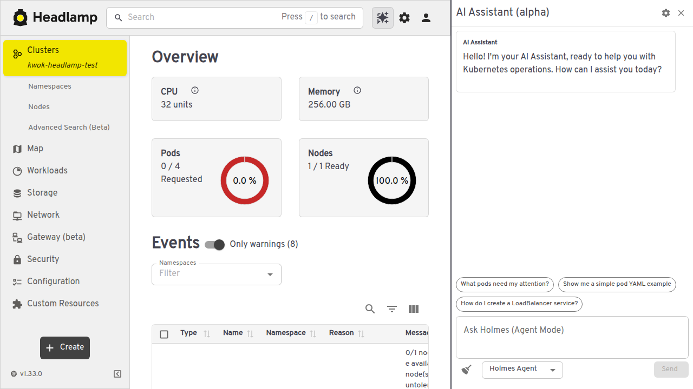
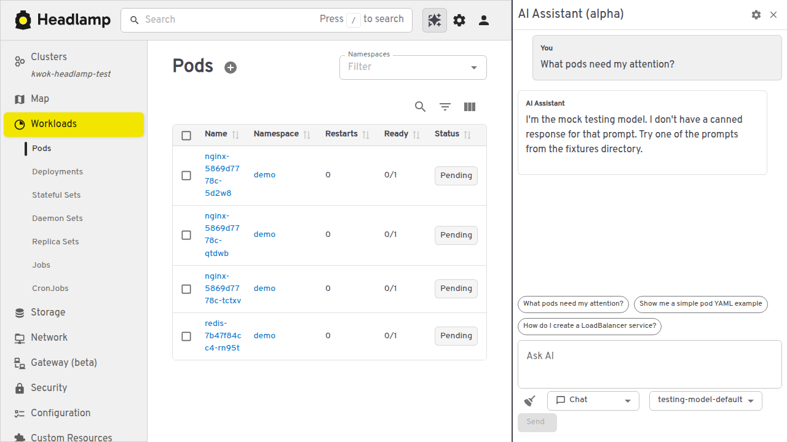
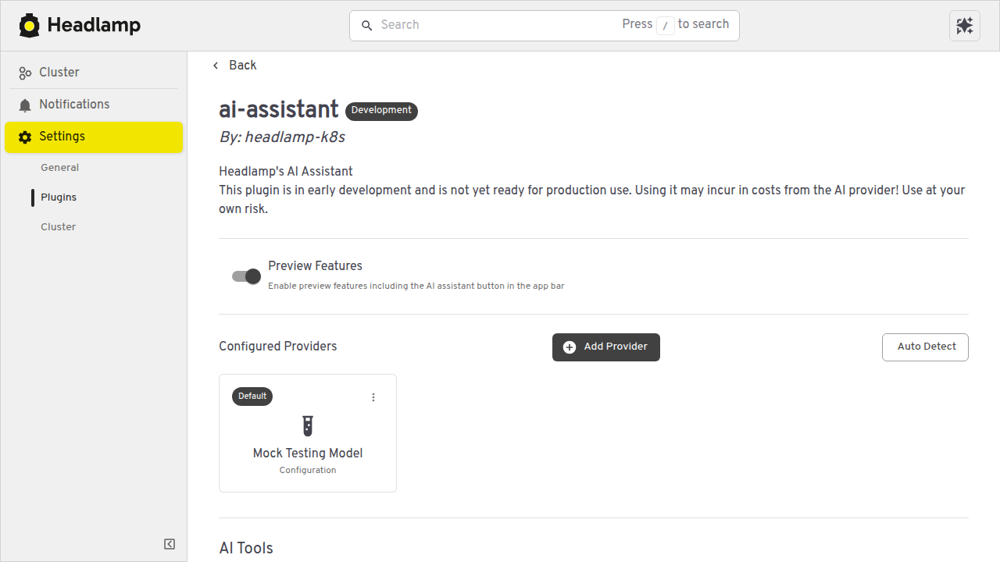
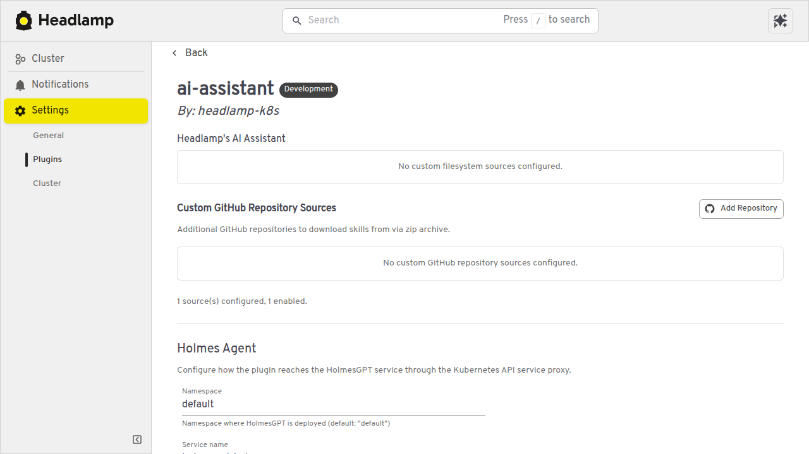
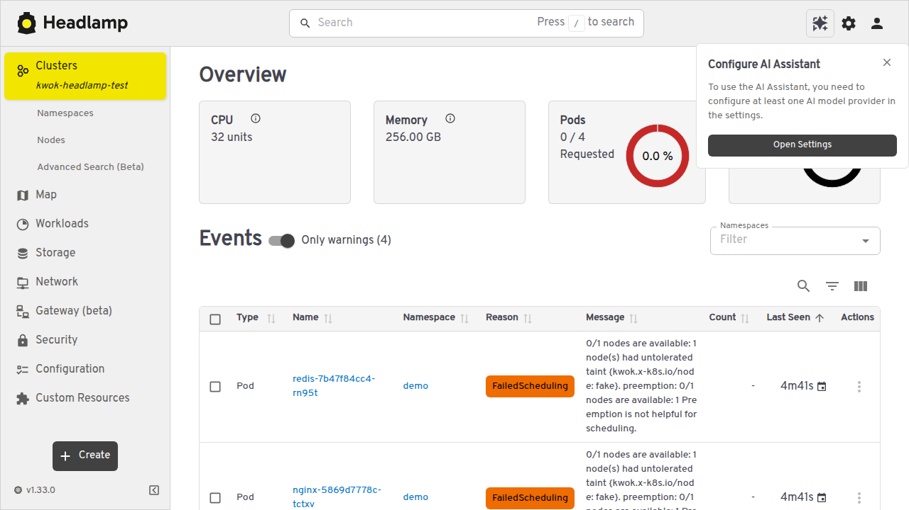

# E2E Demo with KWOK

End-to-end demonstration of the AI Assistant running against a [KWOK](https://kwok.sigs.k8s.io/) fake cluster with mock testing model and skills from GitHub repos.

## What This Demonstrates

| Component | Status | Notes |
|-----------|--------|-------|
| KWOK cluster | ✅ Works | Fake node, pods, deployments via `kwokctl` |
| Mock Testing Model | ✅ Works | `createMockTestingModel()` responds in Chat mode |
| Skills from Git Repos | ✅ Works | 7 well-known repos available, toggleable in settings |
| MCP Servers | ⚠️ Desktop only | MCP requires Electron IPC (stdio transport) |
| Holmes Agent | ⚠️ Needs service | Requires HolmesGPT K8s service running in cluster |

## Quick Start

### 1. Create KWOK Cluster

```bash
kwokctl create cluster --name headlamp-test --runtime binary
kubectl --context kwok-headlamp-test create namespace demo
kubectl --context kwok-headlamp-test -n demo create deployment nginx --image=nginx --replicas=3
kubectl --context kwok-headlamp-test -n demo create deployment redis --image=redis --replicas=1
```

### 2. Build and Run Headlamp

```bash
# Build backend
cd backend && go build -o headlamp-server ./cmd

# Build frontend
cd frontend && npm install && npm run build

# Build plugin
cd plugins/examples/ai-assistant && npm install && npx @kinvolk/headlamp-plugin build

# Copy plugin
mkdir -p /tmp/headlamp-plugins/ai-assistant
cp dist/main.js package.json /tmp/headlamp-plugins/ai-assistant/

# Start server
HEADLAMP_BACKEND_TOKEN=headlamp ./backend/headlamp-server \
  -listen-addr=localhost -port=4466 \
  -kubeconfig=$HOME/.kube/config \
  -html-static-dir=frontend/build \
  -plugins-dir=/tmp/headlamp-plugins
```

### 3. Configure AI Assistant

1. Open http://localhost:4466
2. Click AI Assistant icon (sparkle) → Settings gear
3. Add Provider → select "Mock Testing Model" → Save
4. Enable skills repos in the Skills section
5. Switch to "Chat" mode in the AI panel

## Screenshots

### Cluster Overview with AI Panel
KWOK cluster showing fake node (32 CPU, 256 GB), pods, and AI Assistant panel.



### Mock Testing Model Chat
Chat mode with `testing-model-default` responding to queries against KWOK pods.



### Provider Configuration
Mock Testing Model selected and configured as default provider.



### Skills from Git Repos
Well-known skill repos with Flux Agent Skills enabled.



### Settings Overview
Full settings page with provider, tools, skills, and MCP sections.



## Running MCP and Agent Tests Programmatically

MCP and the fake agent are tested via the e2e test suite (not through the web UI):

```bash
# MCP e2e tests (14 tests) — uses fake-mcp-server.mjs with greet/add tools
cd plugins/examples/ai-assistant/packages/ai-common
npx vitest run --config vitest.e2e.config.ts src/mcp/mcp.e2e.test.ts

# Mock testing model tests (34 tests)
npx vitest run src/mock-testing-model/MockTestingModel.test.ts

# Mock testing agent tests (14 tests)
npx vitest run src/mock-testing-agent/MockTestingAgent.test.ts

# MCP tool routing tests (34 tests)
npx vitest run src/mcp/MCPToolRouter.test.ts src/mcp/MCPEmbeddingRouter.test.ts
```

## Limitations

- **MCP servers** require Electron desktop app for stdio transport — the web UI shows "MCP server configuration is only available in the desktop app"
- **Holmes Agent mode** requires a running HolmesGPT service in the cluster — without it, agent mode messages have no effect
- **KWOK pods stay Pending** because the fake node has a `NoSchedule` taint — this is expected behavior for demo purposes
- **Mock model fallback** returns a generic message when no fixture matches the exact prompt
